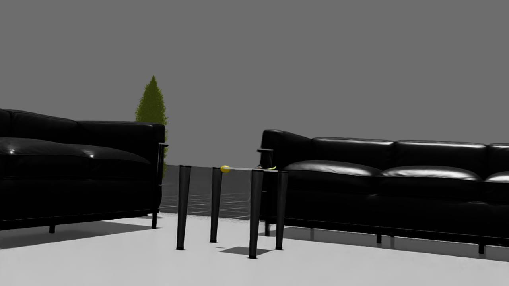
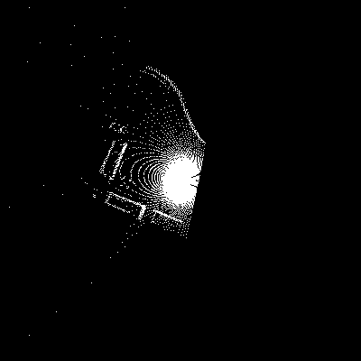
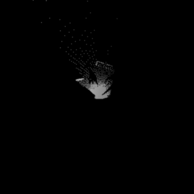
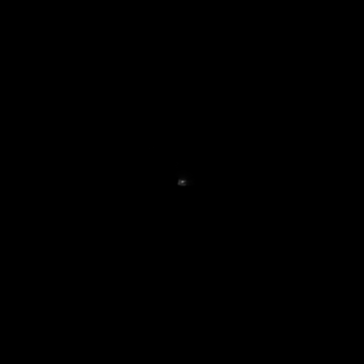
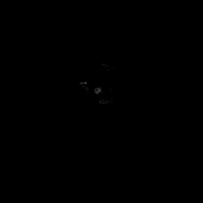

# Go2 ODD/COD Observer

> **Operational Design Domain (ODD) and Condition of Deployment (COD) Analysis for Unitree Go2 Robot**

**Kaggle 5-Day Agents Intensive - Capstone Project**  
🏆 [Competition Details](https://www.kaggle.com/competitions/agents-intensive-capstone-project) | 📚 [Learning Path](https://www.kaggle.com/learn-guide/5-day-agents)

An AI-powered multi-modal system for analyzing Go2 robot behavior in both real and simulated environments. This project uses embodied AI agents to evaluate whether deployment scenarios align with operational design constraints, detect collisions, and measure the distance between actual operating conditions and design boundaries.

---

## Project Context

This project is developed as a capstone for the **[Kaggle 5-Day Agents Intensive](https://www.kaggle.com/learn-guide/5-day-agents)**, demonstrating practical application of AI agents to real-world robotics challenges. The focus is on building multi-modal agents that can:

1. **Process heterogeneous sensor data** (motion, camera, LiDAR) from physical robots
2. **Reason about operational safety constraints** using structured domain knowledge
3. **Provide quantitative assessments** of deployment risk through distance metrics
4. **Bridge simulation and reality** by detecting and adapting to different data sources

---

## Overview

This project implements a comprehensive framework for:

- **Defining Operational Design Domains (ODD)** in natural language
- **Analyzing real-world and simulated deployment conditions (COD)** using multi-modal AI agents
- **Computing continuous COD–ODD distance metrics** to quantify operational safety margins
- **Detecting collisions** using motion, camera, and LiDAR fusion
- **Classifying scenarios** as compliant, boundary-heavy, or ODD-violating

### Key Features

- 🤖 **Multi-Modal Agent Architecture**: Motion, Camera, LiDAR, and Collision analysis agents
- 📊 **Quantitative ODD Compliance**: Continuous distance metrics per scenario
- 🔍 **Sim vs Real Detection**: Automatic classification of data sources
- 💥 **Collision Detection**: Multi-sensor fusion for impact identification
- 📈 **Visual Analytics**: Timeline plots, distributions, and scenario reports
- 🌐 **Natural Language ODD Specification**: Convert human-readable constraints into machine specs

---

## Architecture

### Data Flow

```
ROS2 Bag Files (Go2 Robot)
         ↓
   Window Extraction (Local)
         ↓
   Multi-Modal Agents (Kaggle/ADK)
    ├─ Motion Agent
    ├─ Image Agent
    ├─ LiDAR Agent
    ├─ Collision Agent
    └─ Data Source Agent
         ↓
   ODD Evaluator & Distance Computation
         ↓
   COD Profile & Scenario Classification
         ↓
   Visualization & Reports
```

### ODD Axes

The system evaluates scenarios across multiple dimensions:

- **Speed**: Forward velocity (m/s)
- **Roll/Pitch**: Vehicle orientation (degrees)
- **Terrain**: Surface classification (smooth/moderate/rough/very_rough)
- **Lighting**: Visual conditions (bright/dim/dark)
- **Human Proximity**: Distance to people (none/visible_far/very_close)
- **Collisions**: Impact detection (yes/no)
- **Domain**: Sim vs Real (metadata tag)

---

## Repository Structure

```
go2-odd-observer/
├── .devcontainer/             # ROS2 Humble dev container config
│   ├── devcontainer.json
│   ├── Dockerfile
│   ├── post-create.sh
│   └── README.md
├── data/
│   ├── raw_rosbags/           # ROS2 bag files (gitignored)
│   └── processed/
│       ├── runs/              # Per-run window data
│       │   ├── run_001/
│       │   │   ├── motion_run_001_w000.json
│       │   │   ├── cam_run_001_w000.png
│       │   │   ├── bev_occupancy_run_001_w000.png
│       │   │   ├── bev_height_run_001_w000.png
│       │   │   ├── bev_density_run_001_w000.png
│       │   │   ├── bev_roughness_run_001_w000.png
│       │   │   └── index_run_001.csv
│       │   └── run_002/
│       └── manifest.csv       # Run metadata (sim/real tags)
├── docs/
│   └── images/                # Example outputs for documentation
├── scripts/
│   ├── extract_windows.py     # ROS2 bag → multi-modal time windows
│   ├── demo_pipeline_local.py # Local testing with fake agents
│   ├── render_bev.py          # Standalone BEV renderer (deprecated)
│   └── utils_ros.py           # ROS2 utilities
├── odd_cod/
│   ├── __init__.py
│   ├── odd_spec_schema.py     # ODD schema definitions
│   ├── cod_features.py        # COD numeric mappings
│   ├── distance_metrics.py    # Distance computation
│   └── config_example.py      # Example ODD specifications
├── tests/
│   └── test_distance_metrics.py
├── LICENSE
├── README.md
├── requirements.txt
├── project_plan.md
└── .gitignore
```

---

## Getting Started

### Prerequisites

- Docker and VS Code with Dev Containers extension
- ROS2 bag files from Unitree Go2 robot (sim or real)
- Google Cloud Project with Gemini API access (for future agent integration)

### Installation

```bash
# Clone the repository
git clone https://github.com/danmartinez78/go2-odd-observer.git
cd go2-odd-observer

# Open in VS Code Dev Container
# VS Code will automatically build the ROS2 Humble container
# All dependencies (ROS2, Python packages) are pre-configured
```

### Basic Workflow

#### 1. Extract Windows from ROS Bags

Process ROS2 bag files into time-windowed multi-modal snapshots:

```bash
# Source ROS2 environment (required in dev container)
source /opt/ros/humble/setup.bash

# Extract windows with multi-channel BEV rendering
python3 scripts/extract_windows.py \
  --rosbag data/raw_rosbags/sim/1/sim_data_0.db3 \
  --output data/processed/runs/run_001 \
  --run-id run_001 \
  --window-length 2.0 \
  --stride 1.0
```

This generates:
- **Motion data (JSON)**: Velocity, IMU (roll/pitch/yaw), odometry, accelerations
- **Camera frames (PNG)**: RGB snapshots at 1280x720
- **Multi-channel LiDAR BEV (4 PNGs per window)**:
  - `bev_occupancy_*.png`: Binary presence grid
  - `bev_height_*.png`: Elevation map (±2m range)
  - `bev_density_*.png`: Measurement density/confidence
  - `bev_roughness_*.png`: Terrain roughness (height variance)
- **Index CSV**: Window metadata with paths to all modalities

#### 2. Define Your ODD

Create a natural language ODD specification using the Python library:

```python
from odd_cod.odd_spec_schema import OddSpec, AxisSpecNumeric, AxisSpecCategorical

odd_spec = OddSpec(
    version="1.0",
    axes={
        "speed": AxisSpecNumeric(
            feature="forward_velocity",
            units="m/s",
            in_odd=[0.0, 1.5],
            near_boundary=[0.0, 1.8],
            hard_limit=[0.0, 2.0]
        ),
        "terrain": AxisSpecCategorical(
            feature="terrain_type",
            allowed_in_odd=["smooth", "moderate"],
            allowed_all=["smooth", "moderate", "rough", "very_rough"]
        )
    },
    importance={"speed": 1.0, "terrain": 0.8}
)
```

#### 3. Test with Demo Pipeline (Current)

Run the local demo pipeline with fake agents:

```bash
python3 scripts/demo_pipeline_local.py \
  --index data/processed/runs/run_001/index_run_001.csv \
  --config odd_cod/config_example.py
```

*Note: Full Gemini agent integration is planned for future releases.*

#### 4. Review Results

The system produces:
- **Per-window classifications**: `in-ODD`, `near-boundary`, `ODD-exit`
- **Scenario distance scores**: Quantified compliance (0 = perfect, 1 = maximum violation)
- **COD profiles**: Statistical distributions across all axes
- **Visual timelines**: Status changes and critical events
- **Collision reports**: Detected impacts with context

---

## Window Structure

Each time window captures a multi-modal snapshot:

### Motion JSON (`motion_run_XXX_wNNN.json`)
```json
{
  "timestamps": [0.0, 0.1, 0.2, ...],
  "cmd_vx": [0.5, 0.52, 0.48, ...],
  "cmd_wz": [0.0, 0.1, 0.0, ...],
  "odom_vx": [0.48, 0.51, 0.47, ...],
  "odom_wz": [0.02, 0.11, 0.01, ...],
  "roll": [0.1, 0.2, 0.15, ...],
  "pitch": [1.2, 1.3, 1.25, ...],
  "yaw": [45.0, 45.2, 45.1, ...],
  "accel_x": [0.1, 0.12, 0.08, ...],
  "accel_y": [0.02, 0.01, 0.03, ...],
  "accel_z": [9.81, 9.82, 9.80, ...]
}
```

### Camera Image (`cam_run_XXX_wNNN.png`)
RGB snapshot from `/robot0/front_cam/rgb` at 1280x720 resolution.



*Note: Simulation rosbags may contain placeholder camera data. Real robot deployments capture actual RGB frames.*

### Multi-Channel LiDAR BEV Images

The system generates **4 separate Bird's Eye View (BEV) feature images** per window, each encoding different terrain characteristics from the LiDAR point cloud:

#### 1. Occupancy (`bev_occupancy_run_XXX_wNNN.png`)
Binary presence grid showing where measurements exist (400x400, 5cm/pixel, ±10m range).



#### 2. Height (`bev_height_run_XXX_wNNN.png`)
Average elevation per cell, normalized from ±2m range to 0-255 grayscale values.



#### 3. Density (`bev_density_run_XXX_wNNN.png`)
Point cloud measurement density per cell, indicating measurement confidence/concentration.



#### 4. Roughness (`bev_roughness_run_XXX_wNNN.png`)
Terrain roughness computed from height variance (std dev) within each cell.



**Multi-Channel BEV Design**: Separate feature images enable multi-modal vision models (e.g., Google Gemini 2.5 Flash) to independently reason about different terrain characteristics through multi-image prompting, improving terrain classification accuracy over single-channel encodings.

---

## Distance Metrics

### Window-Level Distance

For each window, the distance from ODD is computed as:

```python
distance = Σ(w_i * d_i) / Σ(w_i)
```

Where:
- `w_i` = importance weight for axis `i`
- `d_i` = normalized distance from ODD center/bounds for axis `i`

### Scenario-Level Distance

Aggregates window distances with:
- Mean window distance
- Fraction of ODD-exit windows
- Weighted penalties for violations

### Interpretation

- **0.0**: Perfect ODD compliance
- **0.0-0.3**: Within ODD
- **0.3-0.7**: Near boundary
- **0.7-1.0**: ODD violation

---

## Collision Detection

### Pre-Filtering

Candidate windows identified by:
- Large deceleration/jerk
- IMU acceleration spikes
- Command-odometry tracking failures

### Multi-Modal Analysis

The Collision Agent evaluates:
- **Motion**: Sudden velocity changes, impact signatures
- **Camera**: Visual obstacles, contact points
- **LiDAR**: Geometric proximity, surface interactions

### Output
```json
{
  "collision_suspected": true,
  "collision_confidence": 0.87,
  "collision_type": "front_bump",
  "notes": "Rapid deceleration and IMU spike with visible wall contact"
}
```

---

## Sim vs Real Detection

### Data Source Agent

Automatically classifies scenarios using:

1. **Ground Truth**: `manifest.csv` annotations
2. **Heuristics**:
   - Perfect tracking (cmd_vel ≈ odom_vel) → sim
   - Low sensor noise → sim
   - Sim-specific topic names/frame_ids

### Usage

This enables:
- Comparing ODD compliance across environments
- Identifying sim-to-real transfer gaps
- Validating simulation fidelity

---

## Example ODD Specification

```python
from odd_cod.odd_spec_schema import OddSpec, AxisSpecNumeric, AxisSpecCategorical

odd_spec = OddSpec(
    version="1.0",
    axes={
        "speed": AxisSpecNumeric(
            feature="forward_velocity",
            units="m/s",
            in_odd=[0.0, 1.5],
            near_boundary=[0.0, 1.8],
            hard_limit=[0.0, 2.0]
        ),
        "terrain": AxisSpecCategorical(
            feature="terrain_type",
            allowed_in_odd=["smooth", "moderate"],
            allowed_all=["smooth", "moderate", "rough", "very_rough"]
        ),
        "lighting": AxisSpecCategorical(
            feature="lighting_condition",
            allowed_in_odd=["bright", "dim"],
            allowed_all=["bright", "dim", "dark"]
        )
    },
    importance={
        "speed": 1.0,
        "terrain": 0.8,
        "lighting": 0.5
    }
)
```

---

## Planned Agent Pipeline

The following multi-modal AI agent architecture is planned for integration with Google Gemini 2.5 Flash:

### 1. Per-Window Agents
- **Motion Agent**: Analyze velocity, IMU, odometry for speed/tracking/motion classification
- **Image Agent**: Extract lighting conditions, human proximity, environment type from camera
- **LiDAR Agent**: Classify terrain roughness and obstacles from multi-channel BEV images

### 2. Fusion Agents
- **Collision Agent**: Multi-modal fusion for impact detection using motion + camera + LiDAR
- **Data Source Agent**: Sim vs real classification from sensor characteristics

### 3. Analysis Pipeline
- **ODD Evaluator**: Per-axis compliance checking against ODD specification
- **Distance Agent**: Compute window and scenario distance metrics
- **COD Aggregator**: Build statistical COD profile across all windows
- **Scenario Classifier**: Categorize runs as `IN_ODD`, `BOUNDARY_HEAVY`, or `ODD_EXIT`
- **Report Agent**: Generate visualizations and human-readable summaries

**Current Status**: Core preprocessing and Python library complete. Agent integration planned for future development.

---

## Development Roadmap

### Phase 1: Local Preprocessing ✅
- [x] Window extraction from ROS bags
- [x] Multi-channel BEV rendering (occupancy, height, density, roughness)
- [x] ROS2 message deserialization (Image, PointCloud2, Odometry, IMU)
- [x] Time-synchronized multi-modal data extraction
- [x] Manifest management

### Phase 2: Core Python Library ✅
- [x] ODD schema
- [x] COD feature mappings
- [x] Distance metrics
- [x] Unit tests

### Phase 3: Local Pipeline (In Progress)
- [x] Demo pipeline with fake agents
- [ ] Update demo pipeline for multi-channel BEV
- [ ] End-to-end validation with sample data

### Phase 4: Gemini Agent Integration (Planned)
- [ ] Motion analysis agent with Gemini 2.5 Flash
- [ ] Camera analysis agent (lighting, humans, environment)
- [ ] LiDAR analysis agent (terrain classification from 4-channel BEV)
- [ ] Collision detection agent (multi-modal fusion)
- [ ] Full pipeline integration and testing

### Phase 5: Analytics & Visualization (Planned)
- [ ] Timeline plots for ODD compliance over time
- [ ] Distribution charts for COD profile
- [ ] Automated scenario reports
- [ ] Real vs sim comparison dashboards

---

## ROS2 Topics

The system expects the following topics in your rosbag files:

| Topic | Type | Usage |
|-------|------|-------|
| `/robot0/cmd_vel` | `geometry_msgs/Twist` | Command velocities |
| `/robot0/odom` | `nav_msgs/Odometry` | Wheel odometry |
| `/robot0/imu` | `sensor_msgs/Imu` | Inertial measurements |
| `/robot0/joint_states` | `sensor_msgs/JointState` | Joint positions |
| `/robot0/front_cam/rgb` | `sensor_msgs/Image` | RGB camera |
| `/robot0/point_cloud2_L1` | `sensor_msgs/PointCloud2` | LiDAR scan |

---

## Contributing

Contributions are welcome! Please:

1. Fork the repository
2. Create a feature branch
3. Add tests for new functionality
4. Submit a pull request

---

## License

This project is licensed under the MIT License - see the [LICENSE](LICENSE) file for details.

---

## Citation

If you use this work in your research, please cite:

```bibtex
@software{go2_odd_observer,
  author = {Martinez, Dan},
  title = {Go2 ODD/COD Observer: Multi-Modal Operational Domain Analysis for Embodied AI},
  year = {2025},
  url = {https://github.com/danmartinez78/go2-odd-observer}
}
```

---

## Acknowledgments

- **Kaggle 5-Day Agents Intensive Program** for inspiring this capstone project
- Unitree Go2 robot platform
- Google Gemini AI for multi-modal analysis
- ROS2 ecosystem

---

## Contact

**Dan Martinez**  
GitHub: [@danmartinez78](https://github.com/danmartinez78)

For questions, issues, or collaboration opportunities, please open an issue on GitHub.
