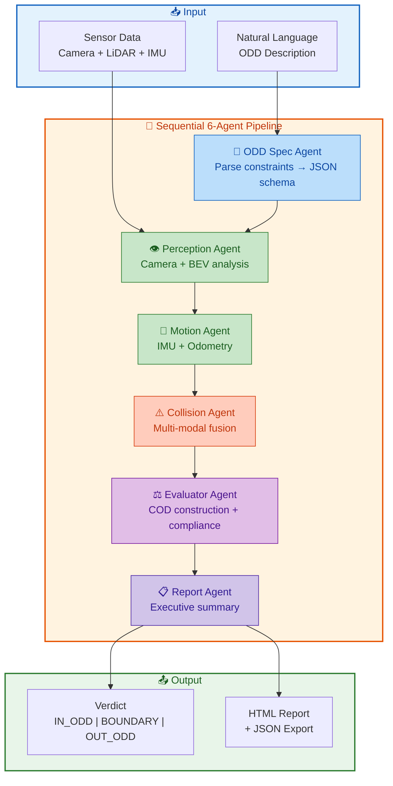
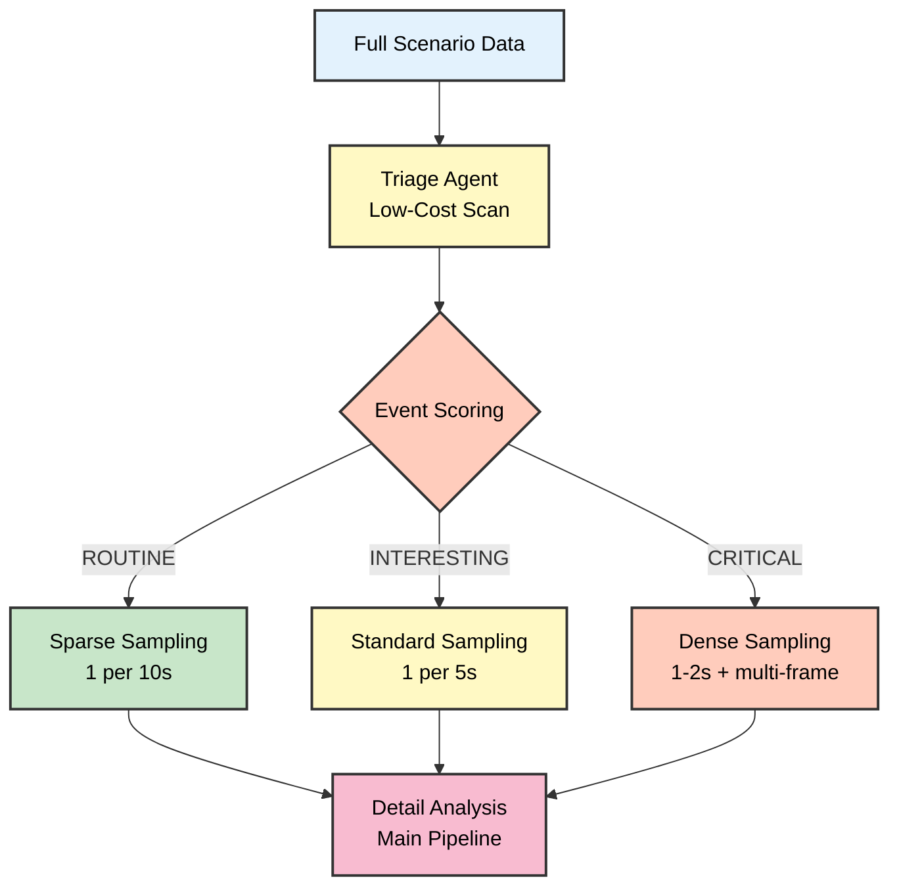

# 🤖 Go2 ODD Observer

<div align="center">

**Multi-Agent AI System for Autonomous Robot Safety Assessment**

*Automatically assess if robots are operating within their design limits using vision, motion, and LiDAR fusion*

[](https://www.kaggle.com/learn-guide/5-day-agents)
[](https://google.github.io/adk-docs/)
[](https://www.python.org)
[](https://docs.ros.org/en/humble/)

[**Quick Start**](#-quick-start) • [**Live Demo**](https://danmartinez78.github.io/go2-odd-observer/) • [**Documentation**](docs/guides/GETTING_STARTED.md) • [**Features**](#-key-features)
[**Agent Knowledge**](docs/agent_knowledge/README.md) • [**Agent Evaluation**](docs/guides/AGENT_EVALUATION.md)

</div>

---

## 🎯 What This Does

**Deploying autonomous robots? Need to know if they're operating safely?**

This system uses **6 pipeline agents + 4 tool agents** (10 LLM-calling entities) to analyze multi-modal sensor data (camera, LiDAR, IMU) and automatically answer:

✅ **Is the robot within its design limits?** (Operational Design Domain compliance)  
⚠️ **Are conditions approaching safety boundaries?** (Warning detection)  
❌ **Has the robot exceeded safe operating conditions?** (Violation detection)

### Key Concepts

**🎯 ODD (Operational Design Domain)**
> The specific conditions and environments a robot is **designed** to operate in. Think of it as the robot's "safe operating zone" - like speed limits, terrain types, and obstacle densities it was designed to handle.

**📊 COD (Current Operating Domain)**  
> The actual conditions the robot is **currently experiencing**, measured from its sensors. This is "where the robot actually is" at any moment.

**⚖️ ODD Compliance**
> Comparing COD vs ODD to detect when actual conditions exceed design specifications. Like a safety check: "Are we still within safe operating limits?"

**Example:** A delivery robot designed for smooth indoor floors (ODD) suddenly encounters gravel parking lot (COD) → System flags `OUT_ODD` violation.

---

## 🌟 Why This Matters

**For Autonomous Systems:**
- 🚨 **Safety Assessment**: Automatically detect when robots enter unsafe conditions
- 📋 **Compliance Documentation**: Generate audit trails for regulatory requirements  
- 🔍 **Post-Incident Analysis**: Understand what went wrong after failures
- 🎯 **Deployment Screening**: Assess new environments before go-live

**Technical Innovation:**
- **ODD-First Architecture**: Define safety constraints before analyzing data (not after)
- **Parameterized Design**: No global state → fully isolated, parallel-safe execution
- **IMU-Based Motion**: Robust motion detection using accelerometers (works when odometry fails)
- **Multi-Modal Fusion**: Camera + LiDAR BEV + IMU combined for holistic safety assessment

---

## ⚡ Quick Start

### 1️⃣ Install

```bash
git clone https://github.com/danmartinez78/go2-odd-observer.git
cd go2-odd-observer
pip install -r requirements.txt
echo "GOOGLE_API_KEY=your-api-key-here" > .env  # Get free key: https://aistudio.google.com
```

### 2️⃣ Run Analysis

```bash
# Interactive analysis CLI (select from test/production scenarios)
python scripts/run_odd_analysis.py
```

### 3️⃣ View Results

**Option A: Interactive HTML Report (Recommended)**
```bash
python scripts/generate_html_report.py \
  --input data/development/analysis_results/manual/latest/full_result.json \
  --scenario-dir data/production/chunks/real_173442_chunk_000_015 \
  --output report.html

open report.html  # or: $BROWSER report.html
```

**Option B: JSON Analysis**
```bash
jq '.report.compliance' data/development/analysis_results/manual/latest/full_result.json
# Output: { "status": "IN_ODD", "confidence": "HIGH", ... }

jq '.reports.executive_summary.compliance.critical_axes' data/development/analysis_results/manual/latest/full_result.json
# Output: [] or ["max_accel_mps2", "max_pitch_deg"]
```

🌐 **Live Examples:** [https://danmartinez78.github.io/go2-odd-observer/](https://danmartinez78.github.io/go2-odd-observer/)  
📚 **Full Setup Guide:** [docs/guides/GETTING_STARTED.md](docs/guides/GETTING_STARTED.md)

---

## ✅ Agent Evaluation (ADK)

- Rubric-based suites for Perception, Motion, Collision, Evaluator, Report, and ODD Spec (see `tests/evaluation`).
- Latest run log: `tests/evaluation/RESULTS.md`.
- Quick run (slow, live LLMs): `pytest tests/test_adk_evaluation.py -q`
- Docs: [docs/guides/AGENT_EVALUATION.md](docs/guides/AGENT_EVALUATION.md)

---

## 🤖 How It Works

### Multi-Agent Analysis Pipeline



**Phase 1.6 Architecture (Current - Dec 2025):**

| Layer | Components | Purpose |
|-------|------------|---------|
| **Pipeline Agents** | OddSpec, Perception, Motion, Collision, Evaluator, Report | Orchestrated by ADK, tracked in metadata |
| **Tool Agents** | 4 embedded VLM tools | LLM calls within tools for specialized analysis |

**Tool Versions:**
- `perception_tool` v12.2.0 — Camera + 3 BEV channels (occupancy, height, roughness)
- `motion_tool` v11.0.0 — IMU + derived motion → trajectory metrics
- `collision_tool` v10.0.0 — Multi-modal evidence fusion (motion + visual + BEV)
- `cod_construction_tool` v1.6.0 — Categorical micro-agent for semantic ODD matching

**Key Capabilities:**
- **Artifact-Based Handoff** — Reliable inter-agent data transfer
- **ODD-Schema Driven** — Adapts to any ODD structure (ground robots, drones, etc.)
- **Derived Motion** — Position-based speed/yaw-rate works for sim and real data
- **Interactive HTML Reports** — Charts, collapsible sections, embedded images

### Multi-Modal Sensor Fusion

| Sensor | What We Extract | Why It Matters |
|--------|----------------|----------------|
| 📷 **Camera** | Environment type, lighting, obstacles | "Is this the indoor office we designed for?" |
| 📡 **LiDAR** | Terrain roughness, traversability, density | "Can the robot physically navigate this space?" |
| 🎯 **IMU** | Acceleration, rotation, platform stability | "Is the robot actually moving? Is it stable?" |

**Smart Fusion:** AI agents combine all three to make holistic safety judgments.

---

## 🔬 Key Features

### 1. Natural Language ODD Specification

Define safety constraints in plain English - AI converts to formal specification:

```python
odd_description = """
Quadruped robot designed for indoor office navigation.
- Designed for: smooth floors, bright/dim lighting, low obstacles
- Prohibited: outdoor, stairs, dark environments, dense clutter
- Speed limit: 0-2.5 m/s
- Max acceleration: 10 m/s², Max pitch/roll: 15°
"""
```

### 2. Real-World Performance

**Current Status:** Phase 1.6 Complete (Production Data + HTML Reports)

**Latest Features (Dec 2025):**
- ✅ **Derived Motion Fields** - Position-based speed/yaw-rate for reliable sim+real analysis
- ✅ **Enhanced Tool Output** - Trajectory metrics, collision signatures, data availability tracking
- ✅ **Interactive HTML Reports** - Line charts, collapsible sections, trajectory details
- ✅ **Production Data Chunking** - 15-window chunks for scalable batch processing
- ✅ **Even Window Sampling** - True even distribution for representative visualization

**Production Data:**
- 📊 **145 windows** across 10 chunks (31 sim + 114 real robot data)
- 🏭 **Auto-cropped BEVs** - 65-72% size reduction with square aspect ratio
- ✅ **3-channel BEV fusion** - Occupancy (obstacles), Height (terrain), Roughness (variance)
- 🤖 **Real robot support** - Odom-frame detection, proper ground filtering
- 📦 **Knowledge layer** - Shared grounding docs (ODD/COD fundamentals, sensor interpretation)

**Test Results:**
- ⏱️ **~2 minutes** for 2-window analysis
- 💰 **Cost varies** by model and scenario complexity
- 🎯 **6 agents** executed successfully
- 📊 **Rich observations** with cross-window temporal reasoning

**Test Data:**
- 📝 **9+ scenarios** available (production chunks + test sets)
- ⚡ **2-window quick tests** (sim_2win, real_2win)
- 🤖 **Validated tools**: Perception v12.2.0, Motion v11.0.0, Collision v10.0.0

### 3. Interactive HTML Reports

**Professional Analysis Reports** with:
- 📊 **Visual summaries** - ODD status, violation counts, key metrics
- 🖼️ **Embedded images** - All BEV LiDAR and camera frames
- 📥 **JSON downloads** - Raw analysis data for custom processing
- 🔗 **GitHub Pages** - Deployed reports at [danmartinez78.github.io/go2-odd-observer](https://danmartinez78.github.io/go2-odd-observer/)
- 📱 **Responsive design** - View on desktop, tablet, or mobile

**Batch Generation:**
```bash
python scripts/generate_all_test_reports.py  # All 7 test scenarios
python scripts/generate_html_report.py --input ... --output ...  # Single report
```

### 4. Flexible Model Configuration

Models are configurable per-agent in `scripts/run_odd_analysis.py`:

| Model | Input Cost | Output Cost | Use Case |
|-------|------------|-------------|----------|
| gemini-2.5-pro | $1.25/1M | $10.00/1M | High-quality analysis |
| gemini-2.5-flash | $0.30/1M | $2.50/1M | Balanced cost/quality |
| gemini-2.0-flash-exp | $0.10/1M | $0.40/1M | Fast iteration |

📊 **Details:** [docs/MODEL_SELECTION_GUIDE.md](docs/MODEL_SELECTION_GUIDE.md)

---

## 📊 Example Results

🌐 **Live Interactive Reports:** [https://danmartinez78.github.io/go2-odd-observer/](https://danmartinez78.github.io/go2-odd-observer/)

### Available Analysis Reports

| Scenario | Verdict | Key Findings |
|----------|---------|---------------|
| **real_173442** | ✅ IN_ODD | Normal indoor operation, 1 collision detected |
| **real_174232** | ⚠️ BOUNDARY | Approaching limits, 3 collisions |
| **real_174321** | ❌ OUT_ODD | Accel 12.63 m/s² (+26%), Pitch 16.9° (+13%) |
| **real_174604** | ❌ OUT_ODD | Human detected 83%, Animal 75% |
| **sim_1** | ✅ IN_ODD | Simulation baseline |

### Example: Motion Violation (real_174321)

**Verdict:** OUT_ODD — Robot exceeded dynamic stability limits

```
Violations:
  • max_accel_mps2: 12.63 m/s² (limit 10.0) — exceeded by 26%
  • max_pitch_deg: 16.9° (limit 15.0) — exceeded by 13%
  • Extreme roll: 18.44° in window w009

Collisions: 1 detected (w012, HIGH confidence)
Recommendation: Tune motion control, investigate collision root cause
```

### Example: Actor Violation (real_174604)

**Verdict:** OUT_ODD — Prohibited actors detected

```
Violations:
  • human_present: 83.3% of windows (limit 0%)
  • animal_present: 75% of windows (limit 0%)
  • clearance_index: 0.2 (below 0.3 minimum)

Collisions: 0 — Robot correctly remained stationary
Recommendation: Review deployment to minimize human-robot interaction
```

> *"The robot operated in an indoor residential setting where it encountered a person and a pet, conditions which are explicitly outside its safety design. The system correctly identified these prohibited actors and remained stationary, preventing any potential collisions."*

📁 **View Full Reports:** [danmartinez78.github.io/go2-odd-observer/reports/](https://danmartinez78.github.io/go2-odd-observer/reports/)

---

## 🗂️ Repository Structure

```
go2-odd-observer/
├── odd_agents/              # Core AI agent module
│   ├── agents/              # 6 pipeline agent implementations
│   ├── tools/               # 4 tool agents (VLM wrappers)
│   └── workflow.py          # Pipeline orchestration
├── scripts/
│   ├── run_odd_analysis.py         # Interactive analysis CLI
│   ├── generate_html_report.py     # HTML report generator
│   ├── extract_windows.py          # ROS2 bag → time windows
│   └── chunk_large_scenario.py     # Split scenarios into chunks
├── notebooks/
│   └── odd_analysis_demo.ipynb     # Interactive demo
├── tests/                   # Unit + evaluation tests
├── data/
│   ├── production/          # Production data (sim + real)
│   │   └── chunks/          # 15-window analysis chunks
│   ├── test/                # 2-window quick test sets
│   └── development/         # Analysis results
└── docs/
    ├── reports/             # HTML reports for GitHub Pages
    ├── agent_knowledge/     # Knowledge docs for agent grounding
    └── guides/              # Setup and usage guides
```

---

## 📚 Documentation

| Document | Description |
|----------|-------------|
| [**Live Demo**](https://danmartinez78.github.io/go2-odd-observer/) | Interactive HTML reports deployed on GitHub Pages |
| [**Getting Started**](docs/guides/GETTING_STARTED.md) | Complete setup, usage examples, troubleshooting |
| [**Agent Architecture**](docs/agents/README.md) | Comprehensive documentation for all 7 agents in the pipeline |
| [**Model Selection**](docs/MODEL_SELECTION_GUIDE.md) | Cost optimization, when to use flash vs 2.5-pro |
| [**Scripts Guide**](scripts/README.md) | Extract windows, render visualizations, generate reports |
| [**Notebooks Guide**](notebooks/README.md) | Interactive analysis, visualizations, exports |
| [**Module API**](odd_agents/README.md) | Parameterized workflow API reference |

---

## 🛠️ Use Cases

### Production Data Analysis

```bash
# Run interactive CLI for scenario selection
python scripts/run_odd_analysis.py

# Generate HTML report with all embedded images
python scripts/generate_html_report.py \
  --input data/development/analysis_results/manual/latest/full_result.json \
  --scenario-dir data/production/chunks/real_173442_chunk_000_015 \
  --output docs/reports/my_report.html
```

### Post-Incident Analysis

```bash
# Extract windows from incident rosbag (source ROS2 first!)
source /opt/ros/humble/setup.bash
python scripts/extract_windows.py \
  --rosbag incident_2025_11_21.db3 \
  --output data/production/incident_analysis \
  --run-id incident_analysis

# Run analysis
python scripts/run_odd_analysis.py --scenario incident_analysis

# Generate report
python scripts/generate_html_report.py \
  --input data/development/analysis_results/manual/latest/full_result.json \
  --scenario-dir data/production/incident_analysis \
  --output incident_report.html
```

### Custom ODD for Different Robots

```python
from odd_agents import run_odd_workflow
from google.genai import Client
import os

# Outdoor delivery robot ODD
outdoor_odd = """
Delivery robot for outdoor sidewalk navigation.
- Designed for: outdoor_urban, concrete/asphalt, moderate slopes
- Lighting: bright daylight to dusk (requires daylight)
- Speed: 0-3.0 m/s
- Obstacles: moderate density OK (designed for pedestrians)
- Weather: dry conditions only
"""

client = Client(api_key=os.getenv("GOOGLE_API_KEY"))
result = await run_odd_workflow(
    scenario_path="data/production/chunks/outdoor_test",
    genai_client=client,
    api_key=os.getenv("GOOGLE_API_KEY"),
    nl_odd_description=outdoor_odd
)
```

---

## 🧪 Testing

```bash
# Test individual agents
python tests/test_perception_agent.py
python tests/test_motion_agent.py
python tests/test_collision_agent.py

# Run unit tests
pytest tests/ -v
```

---

## ⚠️ Limitations and Future Work

### Current System Limitations

**1. Fixed Window Sampling May Miss Critical Events**

**Limitation:** The current system uses **programmatic window selection** (e.g., every 5 seconds) with a single camera frame and LiDAR scan per window. This approach optimizes compute costs but may miss important transient events:

- 💡 **Sudden lighting changes** (bright room → shadow → bright) may be averaged to "moderate"
- 🚨 **Brief collision moments** occurring between sample points go undetected
- 🎯 **Near-miss events** (obstacle appears then disappears) lost in sparse sampling
- 📊 **Rapid regime changes** (clear hallway → sudden clutter) underrepresented

**Impact:** Analysis may underestimate violations or miss safety-critical moments that occur between observation windows.

**Example:**
```
60-second scenario with 5-second sampling:
✅ Captures: 12 windows (general behavior trends)
❌ Misses: Collision at t=17.3s (falls between t=15s and t=20s samples)
❌ Misses: Brief dark hallway t=32-34s (sampled at t=30s in bright room)
```

### Proposed Solution: Intelligent Data Selection Agent

**Multi-Stage Adaptive Pipeline** (Future Phase 5+):



**Approach:**
1. **Quick Scan** (gemini-flash-lite, low-cost):
   - Downsample all camera frames to 128×128 thumbnails
   - Load full IMU time series (low token cost)
   - Generate low-res BEV overview
   
2. **Triage Classification**:
   - Detect regime changes (lighting, obstacle density, motion patterns)
   - Identify anomalies (acceleration spikes, sudden stops, near-misses)
   - Score windows: **ROUTINE** / **INTERESTING** / **CRITICAL**
   
3. **Adaptive Sampling**:
   - ROUTINE: 1 window per 10 seconds (sparse)
   - INTERESTING: 1 window per 5 seconds (current standard)
   - CRITICAL: 1-2 second cadence with multiple frames

**Expected Benefits:**
- ✅ **Better violation detection** - Don't miss transient safety events
- ⚡ **Improved compute efficiency** - Focus expensive analysis on important data
- 🎯 **Adaptive fidelity** - Match analysis depth to scenario complexity
- 📊 **Post-incident investigation** - Automatic zoom-in on anomalies

**Example Impact:**
```
60-second scenario analysis:
Current:   12 windows × $0.02 = $0.24 (may miss events)
Triage:    8 windows × $0.02 + $0.01 triage = $0.17
           ↑ 30% cost savings + better event coverage
```

**Technical Challenges:**
- Downsampling while maintaining event detectability
- Triage agent prompt design (what signals "interesting"?)
- Confidence calibration (avoiding false negatives on subtle violations)

**Timeline:** Phase 5+ or post-Kaggle capstone research project

📚 **Detailed Design:** See [TODO.md § Future Research: Intelligent Data Selection Agent](TODO.md#future-research-intelligent-data-selection-agent)

### Other Known Limitations

**2. BEV Ground Filtering Sensitivity**
- Current 10cm threshold may miss low obstacles (furniture legs, cables)
- Sensor fusion gap: Camera detects obstacles LiDAR filters out
- **Mitigation:** Cross-validation between camera and BEV under investigation

**3. ~~No Velocity Estimation~~ (RESOLVED)**
- ✅ **Fixed:** Position-derived speed now computed from odometry
- `derived_speed` field extracted from position differentiation
- Can now distinguish stationary vs. moving robot states
- See [REAL_DATA_MOTION_FIX.md](docs/REAL_DATA_MOTION_FIX.md) for details

**4. Single-Window Collision Detection**
- Thresholds checked per window (may miss gradual degradation)
- No temporal correlation between consecutive windows
- **Future:** Multi-window trend analysis for early warning

---

## 🤝 Contributing

We welcome contributions!

**High-Priority Contributions:**
- 🎯 **Intelligent triage agent** - Multi-stage adaptive sampling (see above)
- 📊 Fix Plotly chart rendering in HTML reports (currently deferred)
- 🔍 BEV/camera cross-validation for ground filtering tuning
- 🏃 Visual/LiDAR odometry integration (Phase 2)

**Other Ideas:**
- 📡 Add support for new sensor modalities (GPS, ultrasonic, radar)
- 🤖 Generalize for other robot platforms (drones, warehouse AMRs, cars)
- 🎨 Interactive dashboard for batch analysis visualization
- 📈 Time-series trend analysis across multiple scenarios
- 🧪 LLM-as-judge evaluation benchmarks for agent quality

---

## 🏆 Acknowledgments

Built for the **[Kaggle 5-Day Agents Intensive](https://www.kaggle.com/learn-guide/5-day-agents)** program.

**Powered by:**
- 🧠 **Google Gemini 2.5** - Multimodal AI models (Pro, Flash, Flash-Lite)
- 🔧 **Google ADK (Agent Development Kit)** - Agent orchestration framework
- 🤖 **Unitree Go2** - Quadruped robot platform
- 🔗 **ROS2 Humble** - Robotics middleware

---

## 📄 License

MIT License - see [LICENSE](LICENSE)

---

## 📧 Contact

**Author:** Dan Martinez  
**GitHub:** [@danmartinez78](https://github.com/danmartinez78)  
**Issues:** [github.com/danmartinez78/go2-odd-observer/issues](https://github.com/danmartinez78/go2-odd-observer/issues)

---

<div align="center">

**⭐ Star this repo if you find it useful!**

[🏠 Home](https://github.com/danmartinez78/go2-odd-observer) • [📚 Docs](docs/guides/GETTING_STARTED.md) • [🐛 Issues](https://github.com/danmartinez78/go2-odd-observer/issues)

</div>
