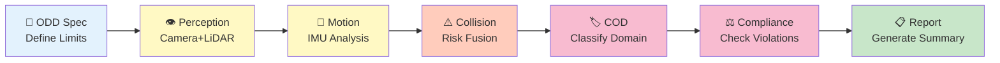

# 🤖 Go2 ODD Observer

<div align="center">

**Multi-Agent AI System for Autonomous Robot Safety Assessment**

*Automatically validate if robots are operating within their design limits using vision, motion, and LiDAR fusion*

[](https://www.kaggle.com/learn-guide/5-day-agents)
[](https://github.com/google/generative-ai-python)
[](https://www.python.org)
[](https://docs.ros.org/en/humble/)

[**Quick Start**](#-quick-start) • [**Documentation**](docs/guides/GETTING_STARTED.md) • [**Features**](#-key-features) • [**Examples**](#-example-results)

</div>

---

## 🎯 What This Does

**Deploying autonomous robots? Need to know if they're operating safely?**

This system uses **10 specialized AI agents** to analyze multi-modal sensor data (camera, LiDAR, IMU) and automatically answer:

✅ **Is the robot within its design limits?** (Operational Design Domain compliance)  
⚠️ **Are conditions approaching safety boundaries?** (Warning detection)  
❌ **Has the robot exceeded safe operating conditions?** (Violation detection)

### Key Concepts

**🎯 ODD (Operational Design Domain)**
> The specific conditions and environments a robot is **designed** to operate in. Think of it as the robot's "safe operating zone" - like speed limits, terrain types, and obstacle densities it was built to handle.

**📊 COD (Current Operating Domain)**  
> The actual conditions the robot is **currently experiencing**, measured from its sensors. This is "where the robot actually is" at any moment.

**⚖️ ODD Compliance**
> Comparing COD vs ODD to detect when actual conditions exceed design specifications. Like a safety check: "Are we still within safe operating limits?"

**Example:** A delivery robot designed for smooth indoor floors (ODD) suddenly encounters gravel parking lot (COD) → System flags `OUT_ODD` violation.

---

## 🌟 Why This Matters

**For Autonomous Systems:**
- 🚨 **Safety Validation**: Automatically detect when robots enter unsafe conditions
- 📋 **Compliance Documentation**: Generate audit trails for regulatory requirements  
- 🔍 **Post-Incident Analysis**: Understand what went wrong after failures
- 🎯 **Deployment Validation**: Verify new environments before go-live

**Technical Innovation:**
- **ODD-First Architecture**: Define safety constraints before analyzing data (not after)
- **Parameterized Design**: No global state → fully isolated, parallel-safe execution
- **IMU-Based Motion**: Robust motion detection using accelerometers (works when odometry fails)
- **Cost-Optimized AI**: Smart model selection defaults to flash-lite (~70% cheaper than pro models)

---

## ⚡ Quick Start

### 1️⃣ Install

```bash
git clone https://github.com/danmartinez78/go2-odd-observer.git
cd go2-odd-observer
pip install -r requirements.txt
echo "GOOGLE_API_KEY=your-api-key-here" > .env  # Get free key: https://aistudio.google.com
```

### 2️⃣ Run Analysis

```bash
# Analyze test dataset (2 windows, ~1 minute)
python scripts/odd_workflow.py
```

### 3️⃣ View Results

```bash
# See compliance status
jq '.full_analysis.odd_compliance.odd_compliance' \
   data/processed/runs/sim_run_test/odd_analysis_report.json
```

**Output:**
```json
{
  "overall_compliance": "OUT_ODD",
  "violations": ["obstacle_density", "collision_risk"],
  "warnings": ["lighting_conditions"]
}
```

📚 **Full Setup Guide:** [docs/guides/GETTING_STARTED.md](docs/guides/GETTING_STARTED.md)

---

## 🤖 How It Works

### 10-Agent Pipeline



### Multi-Modal Sensor Fusion

| Sensor | What We Extract | Why It Matters |
|--------|----------------|----------------|
| 📷 **Camera** | Environment type, lighting, obstacles | "Is this the indoor office we designed for?" |
| 📡 **LiDAR** | Terrain roughness, traversability, density | "Can the robot physically navigate this space?" |
| 🎯 **IMU** | Acceleration, rotation, platform stability | "Is the robot actually moving? Is it stable?" |

**Smart Fusion:** AI agents combine all three to make holistic safety judgments.

---

## 🔬 Key Features

### 1. Natural Language ODD Specification

Define safety constraints in plain English - AI converts to formal specification:

```python
odd_description = """
Quadruped robot designed for indoor office navigation.
- Designed for: smooth floors, bright/dim lighting, low obstacles
- Prohibited: outdoor, stairs, dark environments, dense clutter
- Speed limit: 0-1.5 m/s
- Collision risk threshold: <0.3 (low risk only)
"""
```

### 2. Real-World Performance

Tested on 26 seconds of robot operation (13 windows):
- ✅ **100% motion detection** using IMU (even when odometry broken)
- ⚠️ **8 collision warnings** detected from multimodal fusion
- ❌ **4 ODD violations** flagged: lighting, obstacles, traversability, collision risk
- 🎯 **95% confidence** environment classification (indoor office vs outdoor, etc.)

### 3. Cost-Optimized Execution

| Agent Type | Model | Cost |
|------------|-------|------|
| Vision Analysis | gemini-2.5-pro | Baseline |
| Simple Synthesis | gemini-2.0-flash-lite | **70% cheaper** |

**Result:** ~$0.01 per analysis (2 windows) or ~$0.05 per full run (13 windows)

📊 **Details:** [docs/MODEL_SELECTION_GUIDE.md](docs/MODEL_SELECTION_GUIDE.md)

---

## 📊 Example Results

**Scenario:** `sim_run_new` - Unitree Go2 navigating indoor office environment (13 time windows, simulation)

### ODD Compliance Analysis

```
Overall Status: OUT_ODD

❌ VIOLATIONS (1):
   • traversability_score: 0.38 (minimum: 0.50)
     → Robot frequently in areas with blocked/narrow paths
     
⚠️  WARNINGS (1):
   • collision_risk: 0.412 (boundary: 0.3-0.5)
     → Approaching unsafe collision likelihood threshold

✅ IN_ODD (5):
   • environment_type: indoor_office ✓
   • lighting_conditions: bright ✓
   • terrain_type: smooth ✓
   • obstacle_density: 0.53 (limit: 0.60) ✓
   • platform_stability: stable ✓
```

### AI-Generated Executive Summary

> *"The Unitree Go2 robot is operating in a simulated indoor office environment. While the environment generally aligns with the ODD, a low traversability score and high collision risk, coupled with multiple instances of near-collision scenarios, suggest a need for caution and potential adjustments to the operating strategy."*

### Key Findings

1. 🚨 **High Obstacle Proximity**: Robot frequently positioned in close proximity to static obstacles (sofas, tables, furniture)
2. 📉 **Low Traversability**: Average traversability score of 0.38 indicates constrained navigation space
3. ⚠️ **Collision Risk**: Mean collision risk of 0.412 approaches safety boundary (threshold: 0.5)

### Recommendations

1. **Path Planning**: Implement improved obstacle avoidance to maintain safe clearance distances
2. **Traversability Analysis**: Investigate factors contributing to low traversability scores
3. **Environment Assessment**: Consider pre-deployment site surveys to identify high-risk areas

📁 **Full Reports:** 
- [`data/examples/demo_analysis_report.json`](data/examples/demo_analysis_report.json) (30KB - complete analysis)
- [`data/examples/demo_executive_summary.json`](data/examples/demo_executive_summary.json) (1.7KB - key insights)

---

## 🗂️ Repository Structure

```
go2-odd-observer/
├── odd_agents/              # Core AI agent module (parameterized, no global state)
│   ├── agents/              # 10 agent implementations (perception, motion, etc.)
│   ├── tools/               # Agent tool functions (Gemini API wrappers)
│   └── workflow.py          # Pipeline orchestration
├── scripts/
│   ├── odd_workflow.py      # Main production script (50 lines)
│   └── extract_windows.py   # ROS2 bag → time windows converter
├── notebooks/
│   └── odd_analysis_demo.ipynb  # Interactive analysis with visualizations
├── tests/                   # Unit tests for each agent
├── data/
│   └── processed/runs/      # Scenario datasets (sim_run_test, sim_run_new)
└── docs/
    ├── guides/              # Setup, usage, patterns
    ├── examples/            # Sample reports
    └── MODEL_SELECTION_GUIDE.md
```

---

## 📚 Documentation

| Document | Description |
|----------|-------------|
| [**Getting Started**](docs/guides/GETTING_STARTED.md) | Complete setup, usage examples, troubleshooting |
| [**Agent Architecture**](docs/agents/README.md) | Comprehensive documentation for all 10 agents in the pipeline |
| [**Model Selection**](docs/MODEL_SELECTION_GUIDE.md) | Cost optimization, when to use flash-lite vs 2.5-pro |
| [**Scripts Guide**](scripts/README.md) | Extract windows, render visualizations, generate data |
| [**Notebooks Guide**](notebooks/README.md) | Interactive analysis, visualizations, exports |
| [**Module API**](odd_agents/README.md) | Parameterized workflow API reference |

---

## 🛠️ Use Cases

### Validate New Deployment Site

```bash
# Extract windows from deployment test run
python scripts/extract_windows.py --rosbag my_site_test.db3 --output data/processed/runs/site_test

# Analyze (edit scripts/odd_workflow.py: SCENARIO_PATH = "site_test")
python scripts/odd_workflow.py

# Check compliance
jq '.full_analysis.odd_compliance.odd_compliance.overall_compliance' \
   data/processed/runs/site_test/odd_analysis_report.json
# Output: "IN_ODD" ✅ or "OUT_ODD" ❌
```

### Post-Incident Analysis

```bash
# Extract windows around incident timestamp
python scripts/extract_windows.py --rosbag incident_2025_11_21.db3 --output data/processed/runs/incident

# Run analysis
python scripts/odd_workflow.py

# Find what went wrong
jq '.full_analysis.odd_compliance.odd_compliance.violations' \
   data/processed/runs/incident/odd_analysis_report.json
```

### Custom ODD for Different Robots

```python
# Outdoor delivery robot ODD
outdoor_odd = """
Delivery robot for outdoor sidewalk navigation.
- Designed for: outdoor_urban, concrete/asphalt, moderate slopes
- Lighting: bright daylight to dusk (requires daylight)
- Speed: 0-3.0 m/s
- Obstacles: moderate density OK (designed for pedestrians)
- Weather: dry conditions only
"""

result = await run_odd_workflow(
    scenario_path="outdoor_test",
    nl_odd_description=outdoor_odd
)
```

---

## 🧪 Testing

```bash
# Test individual agents
python tests/test_perception_agent.py
python tests/test_motion_agent.py
python tests/test_collision_agent.py

# Run unit tests
pytest tests/ -v
```

---

## 🤝 Contributing

We welcome contributions! See [CONTRIBUTING.md](CONTRIBUTING.md) for guidelines.

**Ideas for contributions:**
- 📡 Add support for new sensor modalities (GPS, ultrasonic, radar)
- 🤖 Generalize for other robot platforms (drones, warehouse AMRs, cars)
- 📊 Implement LLM-as-judge evaluation benchmarks
- 📝 Improve documentation with domain-specific examples

---

## 🏆 Acknowledgments

Built for the **[Kaggle 5-Day Agents Intensive](https://www.kaggle.com/learn-guide/5-day-agents)** program.

**Powered by:**
- 🧠 **Google Gemini 2.5 Pro & 2.0 Flash** - Multimodal AI models
- 🔧 **Google ADK (Agent Development Kit)** - Agent orchestration framework
- 🤖 **Unitree Go2** - Quadruped robot platform
- 🔗 **ROS2 Humble** - Robotics middleware

---

## 📄 License

MIT License - see [LICENSE](LICENSE)

---

## 📧 Contact

**Author:** Dan Martinez  
**GitHub:** [@danmartinez78](https://github.com/danmartinez78)  
**Issues:** [github.com/danmartinez78/go2-odd-observer/issues](https://github.com/danmartinez78/go2-odd-observer/issues)

---

<div align="center">

**⭐ Star this repo if you find it useful!**

[🏠 Home](https://github.com/danmartinez78/go2-odd-observer) • [📚 Docs](docs/guides/GETTING_STARTED.md) • [🐛 Issues](https://github.com/danmartinez78/go2-odd-observer/issues)

</div>
