# 🤖 Go2 ODD Observer

<div align="center">

**Multi-Agent AI System for Autonomous Robot Safety Assessment**

*Automatically validate if robots are operating within their design limits using vision, motion, and LiDAR fusion*

[](https://www.kaggle.com/learn-guide/5-day-agents)
[](https://github.com/google/generative-ai-python)
[](https://www.python.org)
[](https://docs.ros.org/en/humble/)

[**Quick Start**](#-quick-start) • [**Live Demo**](https://danmartinez78.github.io/go2-odd-observer/) • [**Documentation**](docs/guides/GETTING_STARTED.md) • [**Features**](#-key-features)

</div>

---

## 🎯 What This Does

**Deploying autonomous robots? Need to know if they're operating safely?**

This system uses **10 specialized AI agents** to analyze multi-modal sensor data (camera, LiDAR, IMU) and automatically answer:

✅ **Is the robot within its design limits?** (Operational Design Domain compliance)  
⚠️ **Are conditions approaching safety boundaries?** (Warning detection)  
❌ **Has the robot exceeded safe operating conditions?** (Violation detection)

### Key Concepts

**🎯 ODD (Operational Design Domain)**
> The specific conditions and environments a robot is **designed** to operate in. Think of it as the robot's "safe operating zone" - like speed limits, terrain types, and obstacle densities it was built to handle.

**📊 COD (Current Operating Domain)**  
> The actual conditions the robot is **currently experiencing**, measured from its sensors. This is "where the robot actually is" at any moment.

**⚖️ ODD Compliance**
> Comparing COD vs ODD to detect when actual conditions exceed design specifications. Like a safety check: "Are we still within safe operating limits?"

**Example:** A delivery robot designed for smooth indoor floors (ODD) suddenly encounters gravel parking lot (COD) → System flags `OUT_ODD` violation.

---

## 🌟 Why This Matters

**For Autonomous Systems:**
- 🚨 **Safety Validation**: Automatically detect when robots enter unsafe conditions
- 📋 **Compliance Documentation**: Generate audit trails for regulatory requirements  
- 🔍 **Post-Incident Analysis**: Understand what went wrong after failures
- 🎯 **Deployment Validation**: Verify new environments before go-live

**Technical Innovation:**
- **ODD-First Architecture**: Define safety constraints before analyzing data (not after)
- **Parameterized Design**: No global state → fully isolated, parallel-safe execution
- **IMU-Based Motion**: Robust motion detection using accelerometers (works when odometry fails)
- **Cost-Optimized AI**: Smart model selection defaults to flash-lite (~70% cheaper than pro models)

---

## ⚡ Quick Start

### 1️⃣ Install

```bash
git clone https://github.com/danmartinez78/go2-odd-observer.git
cd go2-odd-observer
pip install -r requirements.txt
echo "GOOGLE_API_KEY=your-api-key-here" > .env  # Get free key: https://aistudio.google.com
```

### 2️⃣ Run Analysis

```bash
# Analyze test dataset (2 windows, ~1 minute)
python scripts/odd_workflow.py
```

### 3️⃣ View Results

**Option A: Interactive HTML Report (Recommended)**
```bash
python scripts/generate_html_report.py \
  --input data/analysis_results/automated/latest/full_result.json \
  --scenario-dir data/processed/test_data/real/real_03_174232 \
  --output report.html

open report.html  # or: $BROWSER report.html
```

**Option B: JSON Analysis**
```bash
jq '.odd_compliance.overall_status' data/analysis_results/automated/latest/full_result.json
# Output: "OUT_ODD"

jq '.odd_compliance.violations[].parameter' data/analysis_results/automated/latest/full_result.json
# Output: "motion_smoothness", "max_accel_mps2", "collision_risk"
```

🌐 **Live Examples:** [https://danmartinez78.github.io/go2-odd-observer/](https://danmartinez78.github.io/go2-odd-observer/)  
📚 **Full Setup Guide:** [docs/guides/GETTING_STARTED.md](docs/guides/GETTING_STARTED.md)

---

## 🤖 How It Works

### 10-Agent Pipeline

```mermaid
graph LR
    A[📝 ODD Spec<br/>Define Limits] --> B[👁️ Perception<br/>Camera+LiDAR]
    B --> C[🎯 Motion<br/>IMU Analysis]
    C --> D[⚠️ Collision<br/>Risk Fusion]
    D --> E[🏷️ COD<br/>Classify Domain]
    E --> F[⚖️ Compliance<br/>Check Violations]
    F --> G[📋 Report<br/>Generate Summary]
    
    style A fill:#e3f2fd,stroke:#333,stroke-width:2px,color:#000
    style B fill:#fff9c4,stroke:#333,stroke-width:2px,color:#000
    style C fill:#fff9c4,stroke:#333,stroke-width:2px,color:#000
    style D fill:#ffccbc,stroke:#333,stroke-width:2px,color:#000
    style E fill:#f8bbd0,stroke:#333,stroke-width:2px,color:#000
    style F fill:#f8bbd0,stroke:#333,stroke-width:2px,color:#000
    style G fill:#c8e6c9,stroke:#333,stroke-width:2px,color:#000
```



### Multi-Modal Sensor Fusion

| Sensor | What We Extract | Why It Matters |
|--------|----------------|----------------|
| 📷 **Camera** | Environment type, lighting, obstacles | "Is this the indoor office we designed for?" |
| 📡 **LiDAR** | Terrain roughness, traversability, density | "Can the robot physically navigate this space?" |
| 🎯 **IMU** | Acceleration, rotation, platform stability | "Is the robot actually moving? Is it stable?" |

**Smart Fusion:** AI agents combine all three to make holistic safety judgments.

---

## 🔬 Key Features

### 1. Natural Language ODD Specification

Define safety constraints in plain English - AI converts to formal specification:

```python
odd_description = """
Quadruped robot designed for indoor office navigation.
- Designed for: smooth floors, bright/dim lighting, low obstacles
- Prohibited: outdoor, stairs, dark environments, dense clutter
- Speed limit: 0-1.5 m/s
- Collision risk threshold: <0.3 (low risk only)
"""
```

### 2. Real-World Performance

**Production Data Analysis:**
- 📊 **332 windows** across 19 production scenarios (living room navigation)
- 🏭 **25-window chunks** - full scenario analysis with all sensor data
- ✅ **Sensor fusion** - BEV LiDAR + camera + IMU integration
- 🎯 **Collision risk detection** - 72% of windows at alert/caution level (18 high-risk)
- ⚠️ **Motion analysis** - Peak acceleration 8.81 m/s² detected (exceeds 5.0 limit)
- 🔍 **Sensor discrepancies** - Camera detects low obstacles BEV misses

**Test Data Validation:**
- 📝 **7 test scenarios** (6 real robot + 1 simulation)
- ⚡ **2-window analysis** - quick validation for each scenario
- 🤖 **Emergency stop** - Abrupt motion detection and compliance checking
- 📈 **Batch processing** - Automated report generation for all scenarios

### 3. Interactive HTML Reports

**Professional Analysis Reports** with:
- 📊 **Visual summaries** - ODD status, violation counts, key metrics
- 🖼️ **Embedded images** - All BEV LiDAR and camera frames
- 📥 **JSON downloads** - Raw analysis data for custom processing
- 🔗 **GitHub Pages** - Deployed reports at [danmartinez78.github.io/go2-odd-observer](https://danmartinez78.github.io/go2-odd-observer/)
- 📱 **Responsive design** - View on desktop, tablet, or mobile

**Batch Generation:**
```bash
python scripts/generate_all_test_reports.py  # All 7 test scenarios
python scripts/generate_html_report.py --input ... --output ...  # Single report
```

### 4. Cost-Optimized Execution

| Agent Type | Model | Cost |
|------------|-------|------|
| Vision Analysis (Perception, Collision) | gemini-2.5-pro | Baseline |
| Motion & Synthesis | gemini-2.5-flash | **~50% cheaper** |

**Scalable Analysis:**
- 2-window test: ~$0.02 per scenario
- 25-window production: ~$0.15 per chunk
- 332-window full dataset: ~$2.00 total

📊 **Details:** [docs/MODEL_SELECTION_GUIDE.md](docs/MODEL_SELECTION_GUIDE.md)

---

## 📊 Example Results

🌐 **Live Interactive Reports:** [https://danmartinez78.github.io/go2-odd-observer/](https://danmartinez78.github.io/go2-odd-observer/)

### Production Scenario: Living Room Navigation (25 Windows)

**Dataset:** `collection_20251122_173442_chunk_01` - Real Unitree Go2 in indoor living room

### ODD Compliance Analysis

```
Overall Status: OUT_ODD
Windows Analyzed: 25
Violations: 3

❌ VIOLATIONS:
   • motion_smoothness: "abrupt" (all 25 windows)
     → Consistent jerky motion patterns across entire scenario
   
   • max_accel_mps2: 8.81 m/s² (limit: 5.0)
     → Extreme acceleration detected, exceeds safe threshold
   
   • collision_risk: 0.652 average (threshold: 0.5)
     → 18 high/critical collision events detected

🔍 SENSOR DISCREPANCY:
   • Camera detects low-lying obstacles (furniture legs, tables)
   • BEV LiDAR fails to detect same obstacles (ground filtering)
   • Risk: Undetected collision hazards in navigation path

✅ IN_ODD:
   • environment_type: indoor_living_room ✓
   • lighting_conditions: adequate ✓
   • terrain_type: smooth_floor ✓
```

### AI-Generated Executive Summary

> *"The Unitree Go2 demonstrates consistent OUT_ODD status across all 25 analysis windows due to abrupt motion patterns and high collision risk. While the indoor living room environment generally aligns with the intended operational domain, the robot exhibits motion characteristics (8.81 m/s² peak acceleration) that significantly exceed design specifications. A critical sensor fusion issue exists: the camera detects low obstacles that the BEV LiDAR system fails to identify due to ground filtering, creating undetected collision hazards."*

### Key Findings

1. 🚨 **Abrupt Motion Patterns**: All 25 windows show "abrupt" motion smoothness classification
2. ⚡ **Extreme Acceleration**: Peak of 8.81 m/s² exceeds 5.0 m/s² safety limit by 76%
3. ⚠️ **High Collision Risk**: 18 of 25 windows (72%) at alert level, avg risk 0.652
4. 🔍 **Sensor Fusion Gap**: BEV ground filtering (10cm threshold) misses low obstacles visible in camera

### Recommendations

1. **Motion Control Tuning**: Review acceleration limits and motion smoothing parameters
2. **BEV Configuration**: Adjust ground filtering threshold or add camera-based validation
3. **Collision Avoidance**: Implement sensor fusion to reconcile camera vs LiDAR obstacle detection
4. **Path Planning**: Reduce aggressive maneuvers in cluttered indoor environments

📁 **View Full Reports:**
- 🌐 [**Interactive HTML Report**](https://danmartinez78.github.io/go2-odd-observer/reports/collection_20251122_173442_chunk_01_report.html) (51MB with all images)
- 📥 [**JSON Data**](https://danmartinez78.github.io/go2-odd-observer/reports/collection_20251122_173442_chunk_01_full_result.json) (18KB raw analysis)
- 📊 [**Test Scenarios**](https://danmartinez78.github.io/go2-odd-observer/) (7 additional reports)

---

## 🗂️ Repository Structure

```
go2-odd-observer/
├── odd_agents/              # Core AI agent module (parameterized, no global state)
│   ├── agents/              # 10 agent implementations (perception, motion, etc.)
│   ├── tools/               # Agent tool functions (Gemini API wrappers)
│   └── workflow.py          # Pipeline orchestration
├── scripts/
│   ├── run_odd_analysis.py         # Interactive analysis CLI
│   ├── generate_html_report.py     # HTML report generator
│   ├── generate_all_test_reports.py # Batch processing for test scenarios
│   ├── extract_windows.py          # ROS2 bag → time windows converter
│   └── render_bev.py               # BEV LiDAR visualization
├── notebooks/
│   └── odd_analysis_demo.ipynb  # Interactive analysis with visualizations
├── tests/                   # Unit tests for each agent
├── data/
│   ├── processed/
│   │   ├── production/      # 19 production scenarios (332 windows total)
│   │   └── test_data/       # 7 test scenarios (real + sim)
│   └── analysis_results/    # JSON outputs from pipeline runs
└── docs/
    ├── guides/              # Setup, usage, patterns
    ├── reports/             # GitHub Pages HTML reports + JSON downloads
    ├── examples/            # Sample reports
    └── index.html           # GitHub Pages landing page
```

---

## 📚 Documentation

| Document | Description |
|----------|-------------|
| [**Live Demo**](https://danmartinez78.github.io/go2-odd-observer/) | Interactive HTML reports deployed on GitHub Pages |
| [**Getting Started**](docs/guides/GETTING_STARTED.md) | Complete setup, usage examples, troubleshooting |
| [**Agent Architecture**](docs/agents/README.md) | Comprehensive documentation for all 10 agents in the pipeline |
| [**Model Selection**](docs/MODEL_SELECTION_GUIDE.md) | Cost optimization, when to use flash vs 2.5-pro |
| [**Scripts Guide**](scripts/README.md) | Extract windows, render visualizations, generate reports |
| [**Notebooks Guide**](notebooks/README.md) | Interactive analysis, visualizations, exports |
| [**Module API**](odd_agents/README.md) | Parameterized workflow API reference |

---

## 🛠️ Use Cases

### Batch Analysis of Test Scenarios

```bash
# Generate HTML reports for all test scenarios (6 real + 1 sim)
python scripts/generate_all_test_reports.py

# Reports automatically saved to:
# - JSON: data/analysis_results/automated/test_reports_TIMESTAMP/
# - HTML: docs/reports/{scenario_name}_report.html
```

### Production Data Analysis

```bash
# Run interactive CLI for scenario selection
python scripts/run_odd_analysis.py

# Or specify production scenario directly
python scripts/run_odd_analysis.py --scenario collection_20251122_173442_chunk_01

# Generate HTML report with all embedded images
python scripts/generate_html_report.py \
  --input data/analysis_results/manual/latest/full_result.json \
  --scenario-dir data/processed/production/collection_20251122_173442_chunk_01 \
  --output docs/reports/production_report.html
```

### Post-Incident Analysis

```bash
# Extract windows from incident rosbag
python scripts/extract_windows.py \
  --rosbag incident_2025_11_21.db3 \
  --output data/processed/incident_analysis

# Run analysis
python scripts/run_odd_analysis.py --scenario incident_analysis

# Generate report and check violations
python scripts/generate_html_report.py \
  --input data/analysis_results/manual/latest/full_result.json \
  --scenario-dir data/processed/incident_analysis \
  --output incident_report.html

open incident_report.html
```

### Custom ODD for Different Robots

```python
# Outdoor delivery robot ODD
outdoor_odd = """
Delivery robot for outdoor sidewalk navigation.
- Designed for: outdoor_urban, concrete/asphalt, moderate slopes
- Lighting: bright daylight to dusk (requires daylight)
- Speed: 0-3.0 m/s
- Obstacles: moderate density OK (designed for pedestrians)
- Weather: dry conditions only
"""

result = await run_odd_workflow(
    scenario_path="outdoor_test",
    nl_odd_description=outdoor_odd
)
```

---

## 🧪 Testing

```bash
# Test individual agents
python tests/test_perception_agent.py
python tests/test_motion_agent.py
python tests/test_collision_agent.py

# Run unit tests
pytest tests/ -v
```

---

## 🤝 Contributing

We welcome contributions! See [CONTRIBUTING.md](CONTRIBUTING.md) for guidelines.

**Ideas for contributions:**
- � Fix Plotly chart rendering in HTML reports (currently deferred)
- 📡 Add support for new sensor modalities (GPS, ultrasonic, radar)
- 🤖 Generalize for other robot platforms (drones, warehouse AMRs, cars)
- 🎨 Interactive dashboard for batch analysis visualization
- 📈 Time-series trend analysis across multiple scenarios
- 🧪 LLM-as-judge evaluation benchmarks for agent quality

---

## 🏆 Acknowledgments

Built for the **[Kaggle 5-Day Agents Intensive](https://www.kaggle.com/learn-guide/5-day-agents)** program.

**Powered by:**
- 🧠 **Google Gemini 2.5 Pro & 2.0 Flash** - Multimodal AI models
- 🔧 **Google ADK (Agent Development Kit)** - Agent orchestration framework
- 🤖 **Unitree Go2** - Quadruped robot platform
- 🔗 **ROS2 Humble** - Robotics middleware

---

## 📄 License

MIT License - see [LICENSE](LICENSE)

---

## 📧 Contact

**Author:** Dan Martinez  
**GitHub:** [@danmartinez78](https://github.com/danmartinez78)  
**Issues:** [github.com/danmartinez78/go2-odd-observer/issues](https://github.com/danmartinez78/go2-odd-observer/issues)

---

<div align="center">

**⭐ Star this repo if you find it useful!**

[🏠 Home](https://github.com/danmartinez78/go2-odd-observer) • [📚 Docs](docs/guides/GETTING_STARTED.md) • [🐛 Issues](https://github.com/danmartinez78/go2-odd-observer/issues)

</div>
