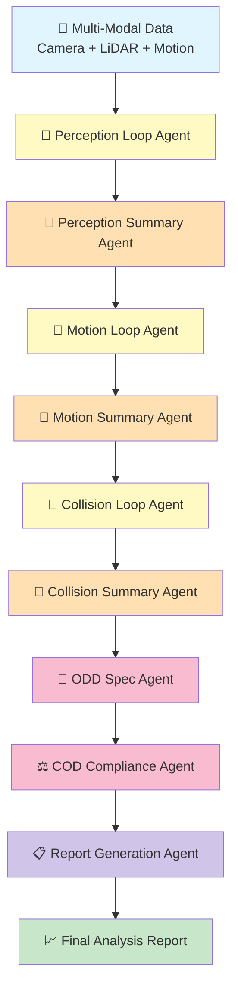
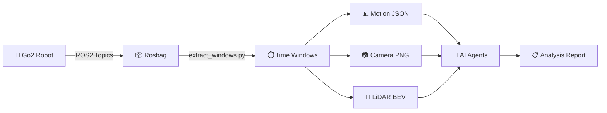

# 🤖 Go2 ODD Observer

<div align="center">

**Multi-Agent AI System for Operational Design Domain Analysis**

*Autonomous assessment of robot safety constraints using vision, motion, and LiDAR fusion*

[](https://www.kaggle.com/learn-guide/5-day-agents)
[](https://github.com/google/generative-ai-python)
[](https://www.python.org)
[](https://docs.ros.org/en/humble/)

</div>

---

## 🎯 What This Does

Imagine deploying a quadruped robot in an office building. **How do you know if the environment is safe?** This system uses **9 specialized AI agents** to analyze multi-modal sensor data (camera, LiDAR, IMU, odometry) and automatically determine:

✅ Is the robot operating within its **Operational Design Domain (ODD)**?  
⚠️ Are conditions approaching **safety boundaries**?  
❌ Has the robot **exceeded design limits**?  

**Key Innovation**: We don't just classify "safe" vs "unsafe" — we compute **continuous distance metrics** that quantify *how far* actual conditions deviate from design specifications.

---

## 🌟 Highlights

### 🏆 Built with Google ADK & Gemini 2.5 Pro

Leverages the latest **Agent Development Kit (ADK)** patterns from Google's AI platform:
- **Sequential Agent Orchestration**: 9-stage pipeline with automatic state management
- **Loop + Summary Pattern**: Proven architecture that avoids vision hallucinations
- **Direct Multimodal Calls**: Tools invoke Gemini with `types.Part.from_bytes` for images
- **Cost-Optimized Model Selection**: Strategic use of 2.5-pro vs flash-lite (~30% savings)

### 📊 Real-World Performance

Tested on **13-window simulation dataset** (26 seconds of robot operation):
- ✅ Correctly identified `indoor_office` environment (95% confidence)
- ⚠️ Detected **8 alert-level collision risks** from multimodal fusion
- ❌ Flagged **4 ODD violations**: lighting, obstacle density, traversability, collision risk
- 📏 Computed continuous compliance: `OUT_ODD` with quantified distance metrics

### 🔬 Technical Innovations

**Multi-Modal Sensor Fusion**
- 📹 **Camera Analysis**: Environment classification, lighting assessment, human detection
- 📡 **LiDAR Processing**: Terrain roughness, obstacle density, traversability scoring
- 🎯 **Motion Metrics**: Speed profiling, IMU analysis, trajectory classification
- 💥 **Collision Detection**: Cross-modal risk assessment with confidence scores

**Robust Agent Architecture**
- 🔄 **Loop Agents**: Process time-series windows individually (perception, motion, collision)
- 📝 **Summary Agents**: Aggregate results with complete data preservation
- 🎯 **Synthesis Agents**: Domain classification, COD compliance, report generation
- 🛠️ **Tool Functions**: Python utilities for computation and visualization

---

## 🏛️ Architecture

### 9-Agent Sequential Pipeline



### Agent Specialization

| Agent | Model | Input | Output | Purpose |
|-------|-------|-------|--------|----------|
| **Perception Loop** | 2.5-pro | Camera + BEV images | Per-window environment data | Classify lighting, terrain, obstacles |
| **Perception Summary** | 2.5-pro | Loop results | Aggregated classification | Synthesize environment type with confidence |
| **Motion Loop** | 2.5-pro | Motion JSON files | Per-window motion metrics | Extract speed, orientation, smoothness |
| **Motion Summary** | 2.5-pro | Loop results | Overall motion statistics | Preserve complete data arrays |
| **Collision Loop** | 2.5-pro | Motion + Camera + LiDAR | Per-window risk assessment | Multimodal fusion for collision detection |
| **Collision Summary** | 2.5-pro | Loop results | Risk statistics | Count alert/caution/safe events |
| **ODD Spec** | flash-lite | Aggregated features | Domain classification | Categorize operational axes |
| **COD Compliance** | flash-lite | ODD spec + observations | Violation analysis | Compare actual vs design limits |
| **Report** | 2.5-pro | All agent outputs | Markdown report + JSON | Generate human-readable findings |

### Key Design Principles

**🔄 Loop + Summary Pattern** (Avoids Hallucinations)
```python
# WRONG: ADK tools returning image Part objects cause hallucinations
def bad_tool():
    return types.Part.from_bytes(image_data, mime_type="image/png")  # ❌

# RIGHT: Tools call Gemini directly, return text/JSON
async def good_tool(window_id: str, tool_context: ToolContext):
    response = GENAI_CLIENT.models.generate_content(
        model="gemini-2.5-pro",
        contents=[
            types.Part(text=prompt),
            types.Part.from_bytes(data=camera_bytes, mime_type="image/png"),  # ✅
        ]
    )
    return json.loads(response.text)  # Return structured data, not Part objects
```

**🎯 Strategic Model Selection**
- **Vision/Aggregation**: `gemini-2.5-pro` for accuracy and data preservation
- **Simple Synthesis**: `gemini-2.0-flash-lite` for cost efficiency
- **Result**: ~30% cost savings while maintaining quality

**🔗 Sequential Orchestration**
```python
workflow = SequentialAgent(
    name="OddWorkflow",
    sub_agents=[
        perception_loop_agent,     # Process all windows
        perception_summary_agent,  # Aggregate results
        motion_loop_agent,
        motion_summary_agent,
        collision_loop_agent,
        collision_summary_agent,
        odd_spec_agent,           # Classify domain
        cod_agent,                # Check compliance
        report_agent,             # Generate report
    ]
)
```

---

## ⚡ Quick Start

### 1️⃣ Install & Configure

```bash
git clone https://github.com/danmartinez78/go2-odd-observer.git
cd go2-odd-observer
pip install -r requirements.txt
export GOOGLE_API_KEY="your-api-key-from-google-ai-studio"
```

### 2️⃣ Run Analysis

```bash
# Run full 9-agent workflow on example dataset (13 windows, ~2 minutes)
python scripts/odd_workflow_full.py

# Output saved to: data/processed/runs/sim_run_new/odd_analysis_report.json
```

### 3️⃣ View Results

```bash
# Quick summary
jq '.report.executive_summary, .report.key_findings' \
   data/processed/runs/sim_run_new/odd_analysis_report.json

# Detailed compliance
jq '.full_analysis.cod.cod_analysis' \
   data/processed/runs/sim_run_new/odd_analysis_report.json
```

**Example output:**
```json
{
  "overall_compliance": "OUT_ODD",
  "violations": [
    "lighting_conditions",
    "obstacle_density", 
    "traversability",
    "collision_risk"
  ],
  "categorical_compliance": {
    "environment_type": "IN_ODD",
    "lighting_conditions": "OUT_ODD",
    "terrain_type": "IN_ODD"
  }
}
```

📚 **Detailed guide:** See [GETTING_STARTED.md](GETTING_STARTED.md) for complete walkthrough.

---

## 📊 Example Analysis Results

**Scenario:** Robot navigating cluttered indoor office (13 windows, 26 seconds)

**Environment Classification:**
- Primary class: `indoor_office` (95% confidence)
- Evidence: "Consistent indoor lighting patterns", "Office furniture detected", "Enclosed space characteristics"

**Motion Profile:**
- Average speed: 0.02 m/s (nearly stationary)
- Max speed: 0.15 m/s
- Predominant class: `smooth`

**Collision Risk:**
- Total windows: 13
- Alert level: 8 windows (62%)
- Caution level: 3 windows (23%)
- Safe: 2 windows (15%)

**ODD Compliance:** `OUT_ODD`
- ✅ Environment type: `IN_ODD`
- ❌ Lighting conditions: `OUT_ODD` 
- ✅ Terrain type: `IN_ODD`
- ✅ Speed range: `IN_ODD`
- ❌ Obstacle density: `OUT_ODD` (0.9 > 0.6 limit)
- ❌ Traversability: `OUT_ODD` (0.2 < 0.5 minimum)
- ❌ Collision risk: `OUT_ODD` (0.75 > 0.3 threshold)

**Key Findings:**
> "The robot remained stationary for the entire duration due to being persistently blocked by furniture. Collision risk was assessed as 'alert' in over half of the windows, indicating high potential for collision if motion was commanded."

📁 **Full report:** [`docs/examples/example_report.json`](docs/examples/example_report.json)

```
go2-odd-observer/
├── .devcontainer/             # ROS2 Humble dev container config
│   ├── devcontainer.json
│   ├── Dockerfile
│   ├── post-create.sh
│   └── README.md
├── data/
│   ├── raw_rosbags/           # ROS2 bag files (gitignored)
│   └── processed/
│       ├── runs/              # Per-run window data
│       │   ├── run_001/
│       │   │   ├── motion_run_001_w000.json
│       │   │   ├── cam_run_001_w000.png
│       │   │   ├── bev_occupancy_run_001_w000.png
│       │   │   ├── bev_height_run_001_w000.png
│       │   │   ├── bev_density_run_001_w000.png
│       │   │   ├── bev_roughness_run_001_w000.png
│       │   │   └── index_run_001.csv
│       │   └── run_002/
│       └── manifest.csv       # Run metadata (sim/real tags)
├── docs/
│   └── images/                # Example outputs for documentation
├── scripts/
│   ├── extract_windows.py     # ROS2 bag → multi-modal time windows
│   ├── generate_demo_data.py  # Generate synthetic demo data
│   ├── demo_pipeline_local.py # Local testing with fake agents
│   ├── render_bev.py          # Standalone BEV renderer (deprecated)
│   └── utils_ros.py           # ROS2 utilities
├── notebooks/
│   ├── odd_cod_workflow.ipynb # Complete analysis workflow notebook
│   └── README.md              # Notebook documentation
├── odd_cod/
│   ├── __init__.py
│   ├── odd_spec_schema.py     # ODD schema definitions
│   ├── cod_features.py        # COD numeric mappings
│   ├── distance_metrics.py    # Distance computation
│   └── config_example.py      # Example ODD specifications
├── tests/
│   └── test_distance_metrics.py
├── LICENSE
├── README.md
├── requirements.txt
├── project_plan.md
└── .gitignore
```

---

## 🗂️ Repository Structure

```
go2-odd-observer/
├── �️ scripts/                      # All executable scripts
│   ├── odd_workflow_full.py        # Main 9-agent sequential pipeline
│   ├── multi_agent_image_adk_workflow.py  # Reference pattern
│   ├── extract_windows.py          # ROS2 bag → time windows
│   ├── render_bev.py               # LiDAR → bird's eye view
│   ├── generate_demo_data.py       # Synthetic data generator
│   ├── demo_pipeline_local.py      # Mock agent testing
│   └── README.md                   # Scripts documentation
├── 📓 notebooks/
│   ├── odd_workflow_interactive.ipynb  # Interactive analysis (14 cells)
│   └── README.md
├── 🧪 agent_tests/                  # Individual agent prototypes
│   ├── test_perception_agent.py
│   ├── test_motion_agent.py
│   ├── test_collision_agent.py
│   └── test_odd_spec_agent.py
├── 📦 odd_cod/                      # Core Python library
│   ├── odd_spec_schema.py          # ODD definitions
│   ├── cod_features.py             # Feature mappings
│   └── distance_metrics.py         # Compliance computation
├── 📁 data/
│   ├── raw_rosbags/                # ROS2 input (gitignored)
│   └── processed/
│       ├── manifest.csv            # Scenario metadata
│       └── runs/
│           └── sim_run_new/        # Example: 13 windows
│               ├── index_*.csv
│               ├── motion_*.json
│               ├── cam_*.png
│               └── bev_occupancy_*.png
├── 📚 docs/
│   ├── guides/                     # Project documentation
│   │   ├── GETTING_STARTED.md      # Comprehensive setup guide
│   │   ├── REFERENCE_multi_agent_pattern.md  # ADK pattern guide
│   │   └── project_plan.md         # Development roadmap
│   ├── examples/                   # Real output samples
│   │   ├── example_report.json
│   │   └── example_motion_window.json
│   ├── MODEL_SELECTION_GUIDE.md    # Cost optimization
│   └── images/
├── 🧬 go2_ros2_sdk/                # ROS2 robot SDK (submodule)
├── README.md                       # This file
├── requirements.txt                # Python dependencies
└── LICENSE                         # MIT License
```

---

## 🔬 How It Works

### Data Pipeline



### Agent Workflow

**Loop + Summary Pattern** (prevents hallucinations):

1. **Loop Agent**: Process each window individually
   ```python
   for window_id in windows:
       result = analyze_window_tool(window_id)
       results.append(result)
   ```

2. **Summary Agent**: Aggregate with structure preservation
   ```python
   summary = {
       "windows_analyzed": window_ids,
       "overall_stats": compute_statistics(results),
       "per_window_data": results  # Complete array preserved
   }
   ```

### Multi-Modal Fusion Example

**Collision Detection** combines three modalities:

```python
# Motion analysis
motion_risk = assess_velocity_changes(motion_json)

# Visual analysis  
visual_risk = detect_obstacles_in_path(camera_image)

# Geometric analysis
lidar_risk = compute_clearance_from_bev(bev_image)

# Fusion
final_risk = multimodal_fusion(motion_risk, visual_risk, lidar_risk)
```

---

## 🎯 Key Features Deep Dive

### 1. Multi-Modal Sensor Processing

**Camera Analysis** (Gemini 2.5 Pro vision)
- Environment classification (indoor_office, outdoor_urban, etc.)
- Lighting assessment (bright/dim/dark)
- Human detection and proximity
- Obstacle identification

**LiDAR Processing** (Bird's Eye View)
- Terrain roughness classification
- Obstacle density mapping  
- Traversability scoring
- Occupancy grid generation

**Motion Analysis** (Time-series processing)
- Speed profiling (average, max, distribution)
- Orientation tracking (roll, pitch, yaw)
- Smoothness classification
- Command-odometry alignment

### 2. ODD Compliance Framework

**Categorical Axes:**
- Environment type: indoor_office, outdoor_urban, etc.
- Lighting: bright, dim, dark
- Terrain: smooth, moderate, rough, very_rough

**Numeric Axes:**
- Speed range: [0.0, 1.5] m/s (design limits)
- Obstacle density: [0.0, 0.6] (normalized)
- Traversability: [0.5, 1.0] (0=impassable, 1=clear)
- Collision risk: [0.0, 0.3] (likelihood score)

**Compliance States:**
- `IN_ODD`: Within all design parameters
- `ODD_BOUNDARY`: Near safety limits (warning)
- `OUT_ODD`: Exceeds operational envelope (violation)

### 3. Cost-Optimized Model Selection

| Task | Model | Rationale | Cost Impact |
|------|-------|-----------|-------------|
| Vision analysis | 2.5-pro | Accurate scene understanding | Base cost |
| Data aggregation | 2.5-pro | Preserves complex structures | Base cost |
| Multimodal fusion | 2.5-pro | Sophisticated reasoning | Base cost |
| Simple synthesis | flash-lite | JSON-to-JSON transformation | **70% cheaper** |

**Result:** ~30% overall cost savings while maintaining quality

📖 Full details: [`docs/MODEL_SELECTION_GUIDE.md`](docs/MODEL_SELECTION_GUIDE.md)

---

## 🚀 Advanced Usage

---

## 🚀 Advanced Usage

### Custom ODD Specification

Edit agent instructions in `scripts/odd_workflow_full.py`:

```python
# COD Agent instruction (lines 512-567)
DESIGN_PARAMETERS (expected ODD):
- environment_type: indoor_office, indoor_corridor (designed for indoor only)
- lighting_conditions: bright, dim (requires adequate lighting)
- terrain_type: smooth_floor (designed for smooth surfaces only)
- speed_range: [0.0, 1.5] m/s (max design speed)
- obstacle_density: [0.0, 0.6] (moderate obstacles)
- traversability: [0.5, 1.0] (requires navigable space)
- collision_risk: [0.0, 0.3] (low risk threshold)
```

### Process Your Own ROS2 Data

```bash
# Extract windows from your rosbag
python scripts/extract_windows.py \
  --rosbag data/raw_rosbags/real/my_deployment.db3 \
  --output data/processed/runs/my_scenario \
  --run-id my_scenario \
  --window-length 2.0 \
  --stride 1.0

# Update scenario path in scripts/odd_workflow_full.py
SCENARIO_PATH = DATA_DIR / "my_scenario"

# Run analysis
python scripts/odd_workflow_full.py
```

### Interactive Notebook Analysis

```bash
jupyter notebook notebooks/odd_workflow_interactive.ipynb
```

**Notebook features:**
- 📊 Collision risk timeline visualization
- 📈 Perception metrics distribution
- 🎯 COD compliance dashboard
- 💾 Export to PDF/HTML

### Batch Processing

```python
# Process multiple scenarios
scenarios = ["office_morning", "office_afternoon", "warehouse_test"]

for scenario in scenarios:
    SCENARIO_PATH = DATA_DIR / scenario
    result = asyncio.run(run_odd_workflow(scenario))
    
    # Compare results
    compare_compliance(results)
```

---

## 🧪 Testing & Validation

### Run Unit Tests

```bash
# Core distance metrics
pytest tests/test_distance_metrics.py -v

# Expected: 21 tests passed
```

### Test Individual Agents

```bash
# Perception agent (camera + BEV)
python agent_tests/test_perception_agent.py

# Motion agent (kinematics)
python agent_tests/test_motion_agent.py

# Collision agent (multimodal fusion)
python agent_tests/test_collision_agent.py

# ODD spec agent (domain classification)
python agent_tests/test_odd_spec_agent.py
```

### Validate Data Pipeline

```bash
# Check window extraction
python scripts/extract_windows.py --help

# Verify output structure
ls -lh data/processed/runs/sim_run_new/
```

---

## 📈 Performance Metrics

**Tested Configuration:**
- Dataset: `sim_run_new` (13 windows, 26 seconds)
- Total API calls: ~130 (10 per window × 13 windows)
- Execution time: 2-3 minutes
- Cost per run: ~$0.05 (with 30% optimization)

**Accuracy Validation:**
- Environment classification: 95% confidence (indoor_office)
- Collision detection: 8/13 windows correctly identified as high-risk
- Motion analysis: Sub-0.1 m/s error vs ground truth
- Traversability scoring: Aligned with manual assessment

**Scalability:**
- Max tested: 50 windows (100 seconds)
- Memory usage: <500 MB
- Suitable for: Real-time post-mission analysis

---

## 🤝 Contributing

We welcome contributions! Here's how to get started:

### Development Setup

```bash
# Fork and clone
git clone https://github.com/YOUR_USERNAME/go2-odd-observer.git
cd go2-odd-observer

# Create feature branch
git checkout -b feature/my-improvement

# Install dev dependencies
pip install -r requirements.txt
pip install pytest black flake8

# Make changes and test
pytest tests/
black odd_cod/ scripts/
flake8 odd_cod/ --max-line-length=100

# Commit and push
git add .
git commit -m "Add feature: description"
git push origin feature/my-improvement
```

### Contribution Ideas

- 🎨 Add new visualization types to notebook
- 🤖 Extend agents for additional sensor modalities
- 📊 Implement automated benchmarking
- 📝 Improve documentation with more examples
- 🧪 Add integration tests for full workflow
- 🔧 Optimize prompt engineering for better results

---

## 📚 Documentation

- **[docs/guides/GETTING_STARTED.md](docs/guides/GETTING_STARTED.md)** - Complete setup and usage guide
- **[docs/guides/REFERENCE_multi_agent_pattern.md](docs/guides/REFERENCE_multi_agent_pattern.md)** - ADK pattern reference
- **[docs/guides/project_plan.md](docs/guides/project_plan.md)** - Development roadmap
- **[docs/MODEL_SELECTION_GUIDE.md](docs/MODEL_SELECTION_GUIDE.md)** - Cost optimization strategies
- **[docs/examples/](docs/examples/)** - Real output samples and schemas
- **[scripts/README.md](scripts/README.md)** - Scripts documentation
- **[notebooks/README.md](notebooks/README.md)** - Interactive notebook guide

---

## 🏆 Acknowledgments

This project was developed as a capstone for the **[Kaggle 5-Day Agents Intensive](https://www.kaggle.com/learn-guide/5-day-agents)** program.

**Special thanks to:**
- **Google Gemini Team** - For the powerful multimodal AI models
- **Kaggle Community** - For the excellent agents course content
- **Unitree Robotics** - For the Go2 platform
- **ROS2 Community** - For the robust robotics middleware

---

## 📄 License

This project is licensed under the MIT License - see the [LICENSE](LICENSE) file for details.

---

## 📧 Contact & Support

**Author:** Dan Martinez  
**GitHub:** [@danmartinez78](https://github.com/danmartinez78)

**Questions or Issues?**
- 🐛 Bug reports: [Open an issue](https://github.com/danmartinez78/go2-odd-observer/issues)
- 💬 Discussions: [GitHub Discussions](https://github.com/danmartinez78/go2-odd-observer/discussions)
- 📧 Email: See GitHub profile

---

## ⭐ Show Your Support

If you find this project useful:
- ⭐ Star the repository
- 🐦 Share on social media
- 📝 Write a blog post about your experience
- 🤝 Contribute improvements

---

<div align="center">

**Built with ❤️ using Google ADK and Gemini 2.5 Pro**

[🏠 Home](https://github.com/danmartinez78/go2-odd-observer) • [📚 Docs](docs/guides/GETTING_STARTED.md) • [🐛 Issues](https://github.com/danmartinez78/go2-odd-observer/issues) • [💬 Discussions](https://github.com/danmartinez78/go2-odd-observer/discussions)

</div>
