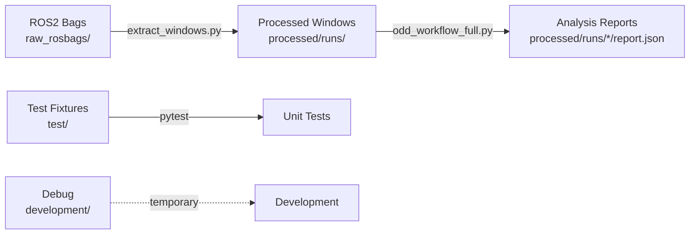

# Data Directory

Organized storage for all project data: raw inputs, processed outputs, test fixtures, and development artifacts.

---

## 📁 Directory Structure

```
data/
├── raw_rosbags/           # ROS2 bag files (input data)
│   ├── real/              # Real robot deployments
│   └── sim/               # Simulation runs
├── processed/             # Extracted and analyzed data
│   ├── runs/              # Per-scenario analysis results
│   │   ├── sim_run_new/   # Example: 13-window simulation
│   │   ├── demo_run/      # Generated demo data
│   │   └── ...
│   └── manifest.csv       # Scenario metadata
├── test/                  # Test fixtures and data
│   ├── images/            # Test images for unit tests
│   └── unit_test_data/    # Test JSON/CSV files
├── development/           # Development artifacts
│   └── debug_frames/      # Debug image outputs
└── examples/              # (Reserved for future use)
```

---

## 📊 Data Organization

### `raw_rosbags/` - Input Data

**Purpose**: Raw ROS2 bag files from robot deployments.

**Structure**:
- `real/` - Physical robot data
- `sim/` - Simulation data

**Note**: These files are large and gitignored. Not included in repository.

**Expected topics**:
- `/robot0/cmd_vel` - Command velocities
- `/robot0/odom` - Odometry
- `/robot0/imu` - IMU data
- `/robot0/front_cam/rgb` - Camera
- `/robot0/point_cloud2_L1` - LiDAR

---

### `processed/` - Extracted Windows

**Purpose**: Time-windowed multi-modal data extracted from rosbags.

**Generated by**: `scripts/extract_windows.py`

**Structure per scenario**:
```
processed/runs/my_scenario/
├── index_my_scenario.csv           # Window metadata
├── motion_my_scenario_w000.json    # Motion time series
├── cam_my_scenario_w000.png        # Camera frame
├── bev_occupancy_my_scenario_w000.png  # LiDAR BEV
├── motion_my_scenario_w001.json
├── cam_my_scenario_w001.png
├── bev_occupancy_my_scenario_w001.png
└── ...
```

**Also contains**:
- `manifest.csv` - Scenario metadata (sim/real tags, notes)
- `odd_analysis_report.json` - Generated by workflow

**Retention**: Keep processed data for reproducibility.

---

### `test/` - Test Fixtures

**Purpose**: Data for unit tests and integration tests.

**Subdirectories**:

#### `test/images/`
Sample images for testing vision agents:
- Various sizes and formats
- Different lighting conditions
- Edge cases (blank, corrupted, etc.)

#### `test/unit_test_data/`
Test fixtures for unit tests:
- `sample_runs.csv` - Mock scenario index
- `run_config.json` - Test configuration
- `metrics_summary.json` - Expected outputs
- `generate_image.py` - Synthetic data generator

**Usage in tests**:
```python
import pytest
from pathlib import Path

TEST_DATA = Path("data/test/unit_test_data")
test_config = TEST_DATA / "run_config.json"
```

---

### `development/` - Development Artifacts

**Purpose**: Temporary outputs during development and debugging.

**Subdirectories**:

#### `development/debug_frames/`
Debug image outputs from extraction/rendering:
- Frame-by-frame extractions
- Intermediate processing steps
- Visualization outputs

**Note**: These are gitignored and safe to delete.

---

## 🔄 Data Flow



---

## 📝 File Naming Conventions

### Motion Files
`motion_{scenario}_{window}.json`
- Example: `motion_sim_run_new_w003.json`

### Image Files
`{type}_{scenario}_{window}.png`
- Camera: `cam_sim_run_new_w003.png`
- BEV: `bev_occupancy_sim_run_new_w003.png`

### Index Files
`index_{scenario}.csv`
- Contains: window_id, start_time, end_time, file paths

### Reports
`odd_analysis_report.json`
- One per scenario directory

---

## 🗑️ Cleanup Commands

```bash
# Remove all debug frames
rm -rf data/development/debug_frames/*

# Remove processed runs (keep manifest)
rm -rf data/processed/runs/*/
# (Regenerate with: python scripts/extract_windows.py)

# Remove generated demo data
rm -rf data/processed/runs/demo_run/
# (Regenerate with: python scripts/generate_demo_data.py)
```

---

## 💾 Backup Recommendations

**Critical** (backup regularly):
- `raw_rosbags/real/` - Irreplaceable real robot data
- `processed/manifest.csv` - Scenario metadata

**Regenerable** (can be recreated):
- `processed/runs/` - From raw rosbags
- `development/` - Debug outputs
- `test/` - Fixtures in version control

---

## 📊 Storage Guidelines

**Typical sizes**:
- ROS2 bag: 100 MB - 10 GB per run
- Processed scenario: 10-50 MB (depends on window count)
- Debug frames: 20-100 MB (temporary)

**Cleanup schedule**:
- Debug frames: Delete after debugging session
- Old processed runs: Archive after 30 days if not in use
- Raw rosbags: Archive to external storage after processing

---

## 🔒 .gitignore

The following are gitignored:
```
data/raw_rosbags/          # Large binary files
data/development/          # Temporary debug outputs
data/processed/runs/*/     # Generated data (except demo_run)
*.db3                      # ROS2 bag database files
```

**Not gitignored**:
```
data/test/                 # Test fixtures
data/processed/manifest.csv  # Scenario metadata
docs/images/               # Documentation images
```

---

## 🚀 Quick Reference

| Task | Command |
|------|---------|
| Extract windows | `python scripts/extract_windows.py --rosbag data/raw_rosbags/real/my.db3 --output data/processed/runs/my_scenario` |
| Generate demo | `python scripts/generate_demo_data.py` |
| Run analysis | `python scripts/odd_workflow_full.py` |
| Check disk usage | `du -sh data/*` |
| List scenarios | `ls -1 data/processed/runs/` |

---

## 📚 Related Documentation

- **Data extraction**: `scripts/README.md`
- **Analysis workflow**: `docs/guides/GETTING_STARTED.md`
- **Example outputs**: `docs/examples/README.md`
