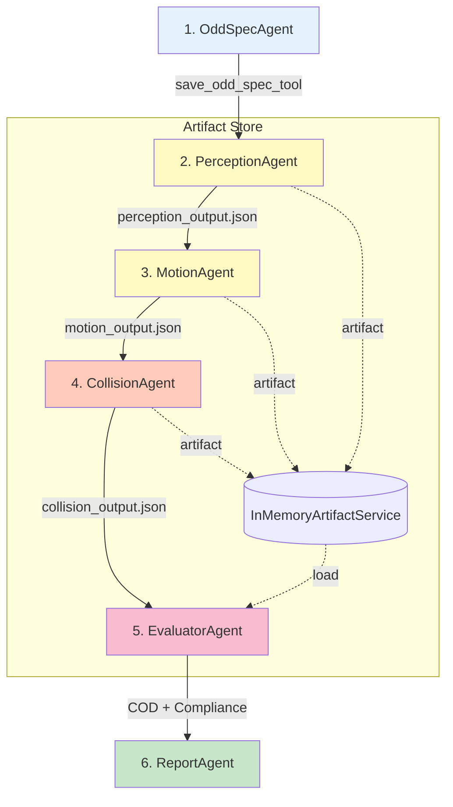

# ODD Analysis Agent Architecture

## Overview

The ODD (Operational Design Domain) Observer uses a **6-agent pipeline** to analyze robot sensor data and determine if the robot is operating within its design specifications. Each agent is specialized for a specific analysis task, working together in a sequential workflow.

**Architecture Update (Phase 1.4.5 - Nov 27, 2025):** 
- Artifact-based inter-agent communication (InMemoryArtifactService)
- Categorical micro-agent for semantic ODD matching
- Data source detection (simulated vs real)
- Report v9.1.0 with hybrid schema
- Model standardization: gemini-2.5-flash for all agents

## Agent Workflow



## Agent Versions (v1.4.5)

| Agent | Version | Model | Purpose |
|-------|---------|-------|---------|
| **OddSpecAgent** | 6.1.0 | gemini-2.5-flash | Converts natural language ODD to typed specification |
| **PerceptionAgent** | 7.4.0 | gemini-2.5-flash | Multimodal analysis + data source detection |
| **MotionAgent** | 7.3.0 | gemini-2.5-flash | IMU-based motion analysis |
| **CollisionAgent** | 7.3.0 | gemini-2.5-flash | Multimodal collision detection |
| **EvaluatorAgent** | 5.0.0 | gemini-2.5-pro | COD construction + compliance verdict |
| **ReportAgent** | 9.1.0 | gemini-2.5-flash | Executive summary + recommendations |

## Tool Versions (v1.4.5)

| Tool | Version | Description |
|------|---------|-------------|
| **save_odd_spec_tool** | 8.0.0 | Saves typed ODD specification |
| **analyze_window_perception_tool** | 5.1.0 | Per-window multimodal perception + data source |
| **analyze_window_motion_tool** | 5.0.0 | Per-window IMU motion analysis |
| **analyze_window_collision_tool** | 5.0.0 | Per-window collision detection |
| **construct_cod_tool** | 1.1.0 | Builds COD with categorical micro-agent |
| **generate_report_tool** | 9.1.0 | Generates hybrid report |

## Agent Categories

### 1. **ODD Specification** (1 agent)
- **[OddSpecAgent](ODD_SPEC.md)** v6.1.0: Converts natural language ODD description to typed specification
  - Uses `save_odd_spec_tool` with strict parameter enforcement
  - Output includes type definitions: `range`, `enum`, `bool`
  - Validates all required ODD dimensions

### 2. **Sensor Agents** (3 agents)
- **[PerceptionAgent](PERCEPTION.md)** v7.4.0: Multimodal analysis + data source detection
  - Detects simulated vs real from visual cues
  - Saves output to `perception_output.json` artifact
- **[MotionAgent](MOTION.md)** v7.3.0: IMU-based motion analysis
  - Saves output to `motion_output.json` artifact
- **[CollisionAgent](COLLISION.md)** v7.3.0: Multimodal collision detection
  - Saves output to `collision_output.json` artifact

### 3. **Synthesis & Reporting** (2 agents)
- **[EvaluatorAgent](COMPLIANCE.md)** v5.0.0: Loads artifacts, builds COD with categorical micro-agent
  - Uses semantic matching for ODD categories (not string comparison)
  - Computes region distance and compliance verdict
- **[ReportAgent](REPORT.md)** v9.1.0: Hybrid schema report generation
  - Generates: compliance, executive_summary, key_findings, scenario_metadata
  - Includes data_source in metadata

## Data Flow

### Artifact-Based Communication (Phase 1.4.5)

**Problem Solved:** Session state passing between agents was unreliable.

**Solution:** Artifacts via `InMemoryArtifactService`:

```python
# Sensor agents save outputs as artifacts
artifact_service = InMemoryArtifactService()

# PerceptionAgent saves
await artifact_service.save_artifact(
    "perception_output.json", 
    perception_data,
    artifact_type="application/json"
)

# EvaluatorAgent loads all sensor outputs
perception = await artifact_service.load_artifact("perception_output.json")
motion = await artifact_service.load_artifact("motion_output.json")
collision = await artifact_service.load_artifact("collision_output.json")
```

**Benefits:**
- Reliable data transfer between agents
- Debuggable (artifacts can be inspected)
- Decouples agent execution from data access

### Input Data
- **Natural Language ODD**: User-provided description of robot's design parameters
- **Sensor Data**: Time-windowed camera images, LiDAR BEV maps, IMU readings
  - **Camera**: RGB images from forward-facing camera
  - **LiDAR BEV**: Bird's-eye occupancy, height, and roughness maps
  - **IMU**: Acceleration and angular velocity measurements

### Final Output
The ReportAgent produces a comprehensive JSON report containing:
- **compliance**: verdict, confidence_value, stability, critical_axes
- **executive_summary**: Paragraph synthesizing scenario findings
- **key_findings**: Top 3-5 observations
- **scenario_metadata**: data_source, window_count, model_versions

## Phase 1.4.5 Key Features

### Categorical Micro-Agent

**Problem:** String comparison flagged semantic equivalences as mismatches:
- "indoor_commercial" vs "office" → flagged as mismatch (wrong!)
- "clear" vs "good" lighting → flagged as mismatch (wrong!)

**Solution:** LLM-based semantic assessment in CODTool v1.1.0:
- Uses gemini-2.5-flash to determine if values are semantically equivalent
- Anti-cheat design: generalizes beyond training examples
- Test suite: `scripts/test_categorical_agent.py`

### Data Source Detection

Perception tool automatically identifies simulated vs real data:

```json
{
  "data_source": {
    "type": "simulated",
    "confidence": 0.95,
    "indicators": [
      "Perfect lighting uniformity",
      "Unnaturally clean surfaces",
      "Geometric precision in furniture placement"
    ]
  }
}
```

**Emergent Behavior:** Downstream agents naturally incorporate data_source context into their reasoning without explicit prompting.

### Report Hybrid Schema (v9.1.0)

```json
{
  "compliance": {
    "verdict": "IN_ODD",
    "confidence_value": 0.85,
    "region_distance": 0.0,
    "stability": "stable",
    "critical_axes": []
  },
  "executive_summary": "The robot successfully operated...",
  "key_findings": ["Finding 1", "Finding 2"],
  "scenario_metadata": {
    "data_source": "simulated",
    "window_count": 2,
    "scenario_id": "sim_test_w010_w011"
  },
  "issues": [],
  "recommendations": ["Recommendation 1"]
}
```

## Performance Characteristics

### Production Test Results (v1.4.5)

| Test | Windows | Verdict | Distance | Cost | Duration |
|------|---------|---------|----------|------|----------|
| sim_test_w010_w011 | 2 | IN_ODD | 0.0 | $0.0155 | 148s |
| sim_1_0_chunk_000_009 | 10 | BOUNDARY | 0.2 | $0.0372 | 510s |

**Key Finding:** Sub-linear scaling (5x windows → 2.4x cost)

### Cost Breakdown by Model

```
gemini-2.5-flash:  $0.15 / 1M input,  $0.60 / 1M output
gemini-2.5-pro:    $1.25 / 1M input, $10.00 / 1M output
```

Most cost comes from Evaluator (gemini-2.5-pro) for complex reasoning.

## Scripts

### Running Analysis
```bash
python scripts/run_odd_analysis.py --scenario data/test/sim/sim_test_w010_w011
```

### Testing Categorical Agent
```bash
python scripts/test_categorical_agent.py
```

## Related Documentation

- **[Getting Started Guide](../guides/GETTING_STARTED.md)**: Setup and usage
- **[Architecture Redesign](../ARCHITECTURE_REDESIGN.md)**: Full design rationale
- **[Model Selection Guide](../MODEL_SELECTION_GUIDE.md)**: Cost optimization strategies
