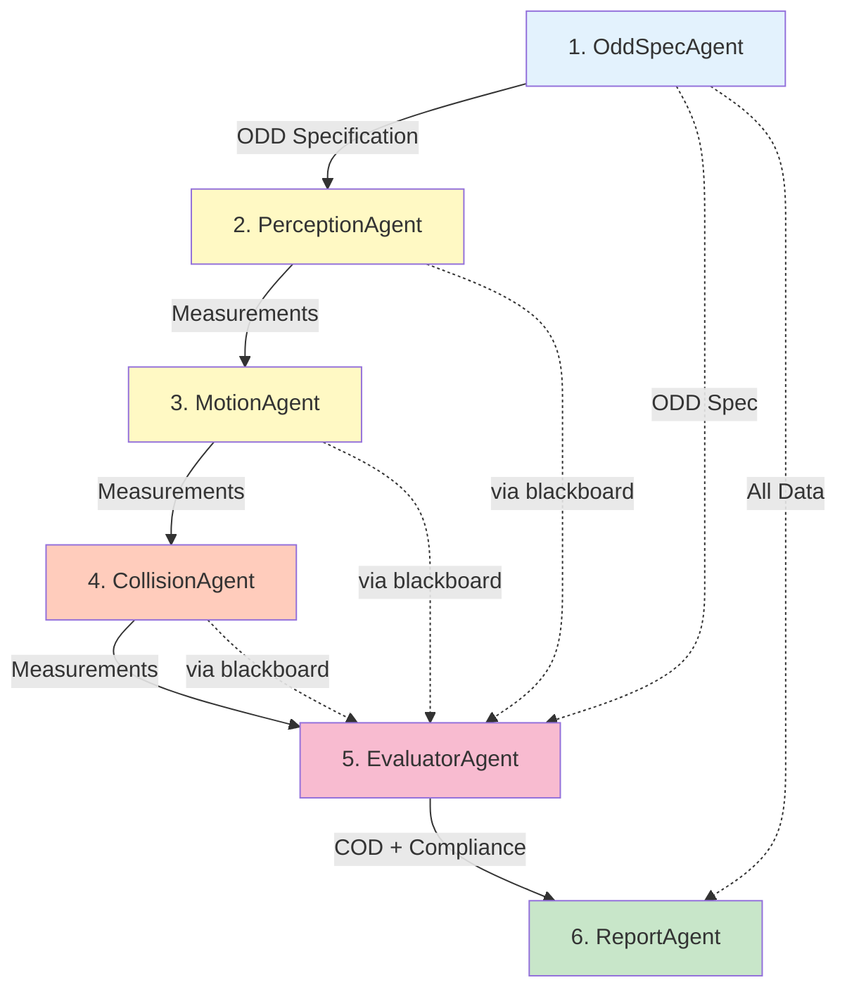

# ODD Analysis Agent Architecture

## Overview

The ODD (Operational Design Domain) Observer uses a **6-agent pipeline** to analyze robot sensor data and determine if the robot is operating within its design specifications. Each agent is specialized for a specific analysis task, working together in a sequential workflow.

**Architecture Update (Phase 1.4.4 - Nov 26, 2025):** 
- Type-driven COD construction with Python tools
- Evaluator Agent replaces COD Measurement + Compliance agents
- Tools read from blackboard via ToolContext (token-efficient)
- ODD specs exclude static robot dimensions and measurement_guidance

## Agent Workflow



## Agent Categories

### 1. **ODD Specification** (1 agent)
- **[OddSpecAgent](ODD_SPEC.md)** v5.0.0: Converts natural language ODD description to typed specification
  - Output includes type definitions: `range`, `enum`, `bool`
  - Excludes static robot dimensions (informational only)
  - No measurement_guidance (agents determine approach)

### 2. **Sensor Agents** (3 agents)
- **[PerceptionAgent](PERCEPTION.md)** v5.0.0: Multimodal analysis with per-window typed measurements
- **[MotionAgent](MOTION.md)** v5.0.0: IMU-based motion analysis with per-window typed measurements
- **[CollisionAgent](COLLISION.md)** v5.0.0: Collision detection with per-window typed measurements

### 3. **Synthesis & Reporting** (2 agents)
- **[EvaluatorAgent](COMPLIANCE.md)** v1.0.0: Python tools for deterministic COD construction + compliance
- **[ReportAgent](REPORT.md)** v4.0.0: Generates executive summary and recommendations

## Data Flow

### Blackboard Keys
Agents communicate via Google ADK's blackboard mechanism:
- `temp:odd_spec` → ODD specification with type definitions
- `temp:perception_output` → Per-window perception measurements
- `temp:motion_output` → Per-window motion measurements  
- `temp:collision_output` → Per-window collision measurements
- `temp:evaluator_output` → COD region + compliance verdict

### Token Optimization
**Phase 1.4.4 Key Innovation:** Tools read from blackboard via `ToolContext.get_value()`:
- Sensor outputs stay on blackboard (not in LLM prompts)
- Evaluator LLM calls tool with minimal params: `construct_cod_tool(odd_spec)`
- Tool internally fetches sensor data from blackboard
- **Result:** Massive token savings on Evaluator agent

### Input Data
- **Natural Language ODD**: User-provided description of robot's design parameters
- **Sensor Data**: Time-windowed camera images, LiDAR BEV maps, IMU readings
  - **Camera**: RGB images from forward-facing camera
  - **LiDAR BEV**: Bird's-eye occupancy, height, and roughness maps
  - **IMU**: Acceleration and angular velocity measurements

### Final Output
The ReportAgent produces a comprehensive JSON report containing:
- Executive summary
- Compliance verdict (IN_ODD/OUT_ODD/BOUNDARY)
- Region metrics (distance, fraction_outside)
- Key findings and recommendations
- Temporal stability assessment

## Phase 1.4.4 Architecture

### Type-Driven COD Construction

ODD axes have explicit types that drive measurement and evaluation:

| Type | Example | COD Construction |
|------|---------|------------------|
| `range` | `max_speed_mps: [0, 1.5]` | Compute min/max from measurements |
| `enum` | `lighting: ["bright", "dim"]` | Collect observed values |
| `bool` | `stairs_present: 0` | Any 1 = OUT_ODD |

### Python Tools for Deterministic Evaluation

The Evaluator Agent uses Python tools (not LLM reasoning) for:
- **COD Region Construction**: `_build_cod_region()` computes envelope from measurements
- **Distance Calculations**: `_compute_region_metrics()` calculates distance to ODD boundary
- **Time Series Analysis**: `_compute_time_series_metrics()` tracks per-window violations

This ensures **reproducible, deterministic** compliance verdicts.

## Model Configuration

| Agent | Recommended Model | Reason |
|-------|------------------|--------|
| PerceptionAgent | `gemini-2.0-flash-thinking-exp` | Reliable multimodal tool calling |
| MotionAgent | `gemini-2.0-flash-exp` | Text-only tools work fine |
| CollisionAgent | `gemini-2.0-flash-exp` | Text-only tools work fine |
| OddSpecAgent | `gemini-2.0-flash-exp` | JSON reasoning |
| EvaluatorAgent | `gemini-2.0-flash-exp` | Simple tool orchestration |
| ReportAgent | `gemini-2.0-flash-exp` | Report synthesis |

## Performance Characteristics

### Typical Execution
- **2-window scenario**: ~25-30 seconds, ~22k tokens, ~$0.40
- **10-window scenario**: ~60-90 seconds, ~40k tokens, ~$0.80
- **62-window scenario**: Use chunking script to split into 10-window batches

### Cost Optimization
- Flash models for most agents (100x cheaper than Pro)
- Thinking model only for perception (multimodal tool reliability)
- Tools read from blackboard (not LLM prompts) to reduce tokens

## Scripts

### Running Analysis
```bash
python scripts/run_odd_analysis.py --scenario sim_test_w010_w011
```

### Chunking Large Scenarios
```bash
python scripts/chunk_large_scenario.py data/production/sim_1_0 --chunk-size 10
```

## Related Documentation

- **[Getting Started Guide](../guides/GETTING_STARTED.md)**: Setup and usage
- **[Architecture Redesign](../ARCHITECTURE_REDESIGN.md)**: Full design rationale
- **[Model Selection Guide](../MODEL_SELECTION_GUIDE.md)**: Cost optimization strategies
