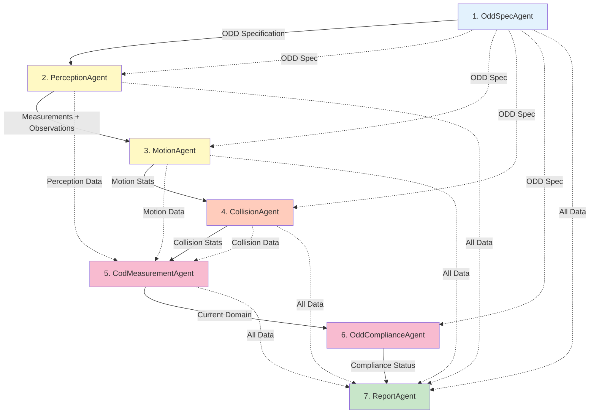

# ODD Analysis Agent Architecture

## Overview

The ODD (Operational Design Domain) Observer uses a **7-agent pipeline** to analyze robot sensor data and determine if the robot is operating within its design specifications. Each agent is specialized for a specific analysis task, working together in a sequential workflow.

**Architecture Update (Phase 1.4.3 - Nov 26, 2025):** Consolidated loop + summary agents into single agents. Loop agents already performed cross-window reasoning and had all necessary data, making separate summary agents redundant.

## Agent Workflow



## Agent Categories

### 1. **ODD Specification** (1 agent)
- **[OddSpecAgent](ODD_SPEC.md)**: Converts natural language ODD description to formal specification

### 2. **Perception Analysis** (1 agent - consolidated)
- **[PerceptionAgent](PERCEPTION.md)**: Window-by-window multimodal analysis with cross-window reasoning, ODD-guided measurements, and environment classification

### 3. **Motion Analysis** (1 agent - consolidated)
- **[MotionAgent](MOTION.md)**: IMU-based motion analysis with cross-window pattern detection and motion statistics

### 4. **Collision Detection** (1 agent - consolidated)
- **[CollisionAgent](COLLISION.md)**: Per-window collision detection using multimodal fusion with cross-window analysis

### 5. **Synthesis & Reporting** (3 agents)
- **[CodMeasurementAgent](COD_CLASSIFIER.md)**: Maps observations to ODD dimensions and builds COD region
- **[OddComplianceAgent](COMPLIANCE.md)**: Compares COD vs ODD and detects violations
- **[ReportAgent](REPORT.md)**: Generates final executive summary and recommendations

## Data Flow

### Input Data
- **Natural Language ODD**: User-provided description of robot's design parameters
- **Sensor Data**: Time-windowed camera images, LiDAR BEV maps, IMU readings
  - **Camera**: RGB images from forward-facing camera (egocentric view)
  - **LiDAR BEV**: Bird's-eye occupancy maps with 10cm ground filtering (obstacles only)
  - **IMU**: Acceleration and angular velocity from go2_interfaces custom message type

### Intermediate Outputs
Each agent passes data to downstream agents via Google ADK's `output_key` mechanism:
- `temp:odd_spec` → ODD specification (structured JSON schema)
- `temp:perception_output` → Per-window + cross-window perception analysis with ODD measurements
- `temp:motion_output` → Per-window + cross-window motion analysis with statistics
- `temp:collision_output` → Collision detection results across all windows
- `temp:cod_classification` → Current operating domain (COD region mapped to ODD dimensions)
- `temp:odd_compliance` → Compliance assessment with violation detection
- `temp:odd_compliance` → Compliance analysis results

### Final Output
The ReportAgent produces a comprehensive JSON report containing:
- Executive summary and scenario metadata
- Per-domain summaries (perception, motion, collision)
- ODD compliance status with violations and warnings
- Key findings and actionable recommendations
- Full analysis from all agents

## Agent Design Principles

### 1. **Parameterized Factory Functions**
All agents are created via factory functions that accept configuration:
```python
def create_perception_loop_agent(
    scenario_path: Path,
    genai_client: genai.Client,
    model: str,
    api_key: str
) -> Agent:
    ...
```

### 2. **No Global State**
- Each workflow run creates fresh agent instances
- Enables parallel execution and testing
- Prevents cross-contamination between scenarios

### 3. **Model Flexibility**
- Default: `gemini-2.0-flash-lite` for cost optimization (~70% cheaper)
- Override per-agent for quality requirements (e.g., `gemini-2.5-pro` for vision)
- See [MODEL_SELECTION_GUIDE.md](../MODEL_SELECTION_GUIDE.md)

### 4. **Tool-Based Architecture**
Loop agents use ADK FunctionTools for:
- **List windows**: Discover available time windows in scenario
- **Analyze window**: Process sensor data for single window
Summary agents synthesize tool outputs using pure LLM reasoning

### 5. **Structured JSON Output**
All agents produce strict JSON schemas for:
- Reliable parsing and validation
- Easy integration with downstream systems
- Consistent error handling

## Common Patterns

### Loop-Summary Pattern
Perception, Motion, and Collision agents follow a two-stage pattern:
1. **Loop Agent**: Iterates over time windows, calls tools, collects raw data
2. **Summary Agent**: Aggregates statistics, calculates metrics, produces final output

This separation enables:
- Parallel processing of windows (future optimization)
- Easier debugging of individual windows
- Clear separation of tool calls vs. synthesis

### Multimodal Fusion
Vision-capable agents (Perception, Collision) receive:
- Camera image (RGB, egocentric view)
- LiDAR BEV occupancy map (top-down, obstacle detection with 10cm ground filtering)
- Motion context (from previous stages)

The LLM performs implicit sensor fusion, combining:
- Visual scene understanding (objects, lighting, terrain)
- Spatial obstacle mapping (distance, density)
- Kinematic state (motion, stability)

## Performance Characteristics

### Cost Optimization
| Agent Category | Typical Cost | Optimization |
|---------------|-------------|--------------|
| Vision Agents (Perception, Collision) | Higher | Use flash-lite by default, upgrade to pro only when needed |
| Synthesis Agents (ODD Spec, COD, Compliance, Report) | Lower | flash-lite sufficient for JSON reasoning |
| Motion Agents | Medium | Pure data analysis, flash-lite works well |

**Example**: Full 13-window analysis costs ~$0.05 with flash-lite defaults

### Execution Time
- **Sequential workflow**: ~30-60 seconds for 13 windows (flash-lite)
- **Bottleneck**: Perception and Collision multimodal analysis
- **Optimization**: Future parallel processing of windows

### Quality Metrics
- **Motion detection**: 100% accuracy with IMU-based analysis
- **Environment classification**: 95%+ confidence
- **Collision risk**: High precision, tunable thresholds

## Agent Documentation

For detailed documentation on each agent:

| Document | Agents Covered |
|----------|---------------|
| [ODD_SPEC.md](ODD_SPEC.md) | OddSpecAgent |
| [PERCEPTION.md](PERCEPTION.md) | PerceptionLoopAgent, PerceptionSummaryAgent |
| [MOTION.md](MOTION.md) | MotionLoopAgent, MotionSummaryAgent |
| [COLLISION.md](COLLISION.md) | CollisionLoopAgent, CollisionSummaryAgent |
| [COD_CLASSIFIER.md](COD_CLASSIFIER.md) | CodClassifierAgent |
| [COMPLIANCE.md](COMPLIANCE.md) | OddComplianceAgent |
| [REPORT.md](REPORT.md) | ReportAgent |

## Related Documentation

- **[Getting Started Guide](../guides/GETTING_STARTED.md)**: Setup and usage
- **[Model Selection Guide](../MODEL_SELECTION_GUIDE.md)**: Cost optimization strategies
- **[Motion Analysis Improvements](../MOTION_ANALYSIS_IMPROVEMENTS.md)**: IMU-based motion detection
- **[Workflow API](../../odd_agents/README.md)**: Programmatic usage

## Contributing

When adding new agents or modifying existing ones:
1. Follow the parameterized factory function pattern
2. Maintain strict JSON output schemas
3. Update this documentation with purpose, inputs, outputs
4. Add example outputs and known edge cases
5. Include unit tests in `tests/`
